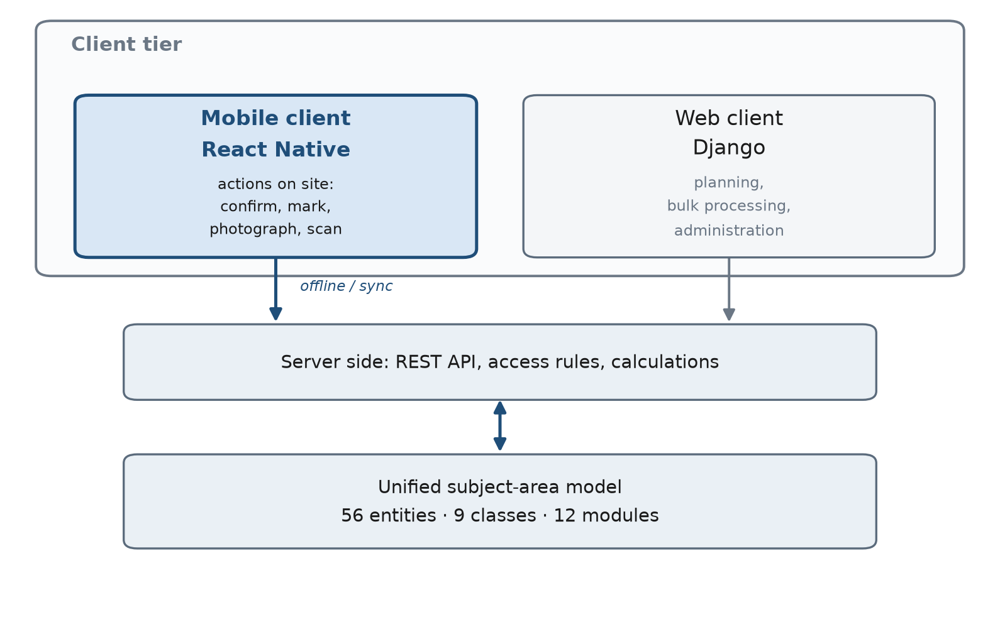
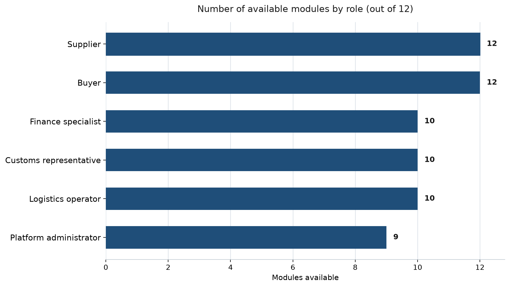
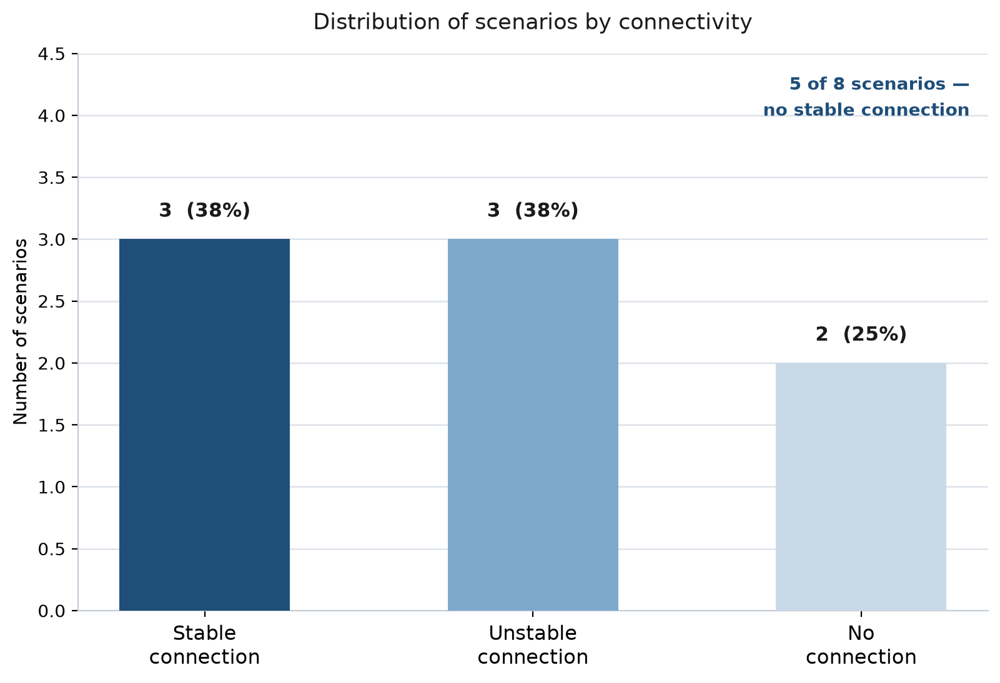
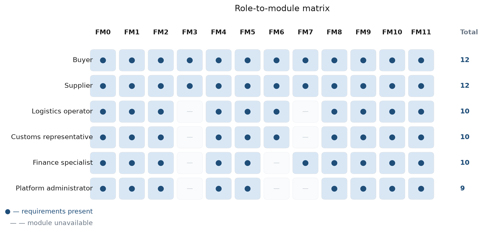
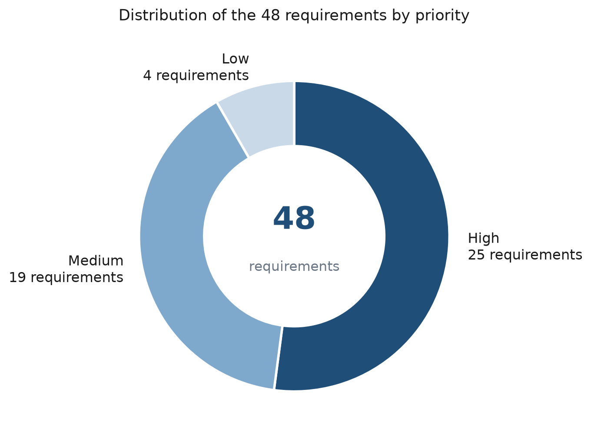

# Mobile client of the “SinoRus TradeLite” platform for Russia–China cross-border trade: subject area and functional requirements

- **Course project:** COURSE PROJECT
- **Discipline:** in the discipline “Mobile Application Development Technology”
- **Stage:** Stage 1. Subject area description and list of functional requirements
- **Completed by:** Completed by: · Student of group PRIk-223 · Yan Yao
- **Accepted by:** Accepted by: · Assist. of the ISSE Dept. · Evdokimov A.O.
- **Place and year:** Vladimir, 2026

> Generated from `requirements.py` and `content_en.py` (`python mdgen.py`). Do not edit by hand.

## ANNOTATION

The document contains 5 figures, 26 tables and 12 references.

This document is the result of the first stage of the course project in the discipline “Mobile Application Development Technology”. It solves two tasks: it describes the subject area of the project from the mobile point of view and forms the list of functional requirements for the mobile application.

Chapter 1 characterises the subject area: the place of the mobile client in the SinoRus TradeLite project, six groups of participants and their interests, eight mobile usage scenarios, the end-to-end deal process in six stages, the boundaries of the scope, the rationale for choosing the React Native platform and a comparison with existing ways of working.

Chapter 2 presents the list of 48 functional requirements grouped into 12 modules. It gives the consolidated register of requirements, the role-to-module matrix, the breakdown of requirements by priority and 12 non-functional requirements.

The outcome of the stage is an agreed list of requirements that serves as the input for designing the data model, screens and navigation of the mobile application at the following stages.

Keywords: mobile application; subject area; functional requirements; non-functional requirements; cross-border trade; React Native; offline mode; usage scenarios

## CONTENTS

- [ANNOTATION](#annotation)
- [DEFINITIONS, SYMBOLS AND ABBREVIATIONS](#definitions-symbols-and-abbreviations)
- [INTRODUCTION](#introduction)
- [1 SUBJECT AREA DESCRIPTION](#1-subject-area-description)
  - [1.1 General characteristics of the subject area](#11-general-characteristics-of-the-subject-area)
  - [1.2 The place of the mobile application in the project](#12-the-place-of-the-mobile-application-in-the-project)
  - [1.3 Participants and their roles](#13-participants-and-their-roles)
  - [1.4 Mobile usage scenarios](#14-mobile-usage-scenarios)
  - [1.5 The end-to-end deal process in the mobile application](#15-the-end-to-end-deal-process-in-the-mobile-application)
  - [1.6 Boundaries of the subject area](#16-boundaries-of-the-subject-area)
  - [1.7 Technological platform](#17-technological-platform)
  - [1.8 Comparison with existing ways of working](#18-comparison-with-existing-ways-of-working)
- [2 LIST OF FUNCTIONAL REQUIREMENTS](#2-list-of-functional-requirements)
  - [2.1 Principles for forming the list](#21-principles-for-forming-the-list)
  - [2.2 Classification of requirements](#22-classification-of-requirements)
  - [2.3 Requirements by module](#23-requirements-by-module)
  - [2.4 Consolidated register of requirements](#24-consolidated-register-of-requirements)
  - [2.5 Role-to-module matrix](#25-role-to-module-matrix)
  - [2.6 Priorities and order of implementation](#26-priorities-and-order-of-implementation)
  - [2.7 Non-functional requirements](#27-non-functional-requirements)
- [CONCLUSION](#conclusion)
- [REFERENCES](#references)
- [APPENDIX A (Glossary)](#appendix-a-glossary)
- [APPENDIX B (Register of requirements by module)](#appendix-b-register-of-requirements-by-module)

## DEFINITIONS, SYMBOLS AND ABBREVIATIONS

| Abbreviation | Explanation |
|---|---|
| API | Application Programming Interface |
| APNs | Apple Push Notification service |
| DBMS | database management system |
| EAEU | Eurasian Economic Union |
| FCM | Firebase Cloud Messaging |
| FR | functional requirements |
| GOST | state standard of the Russian Federation |
| HW/SW | hardware and software complex |
| IS | information system |
| NFR | non-functional requirements |
| PZ | пояснительная записка — explanatory note (the project report) |
| QR | Quick Response — a type of two-dimensional barcode |
| RFQ | Request for Quotation |
| SW | software |
| TLS | Transport Layer Security |
| ToR | terms of reference (technical specification) |
| UI | User Interface |

## INTRODUCTION

The SinoRus TradeLite project is a lightweight collaboration platform for Russia–China cross-border trade. The web version of the platform, developed earlier, covers the complete deal cycle: from a quotation request to the reconciliation of settlements. It brings together 43 pages in 12 modules and rests on 56 subject-area entities grouped into nine classes.

Experience with the web version has shown that a substantial part of the operations is performed away from a desk. A supplier's manager is at an exhibition, a storekeeper is in a warehouse, a customs representative is at a checkpoint, a manager is on a business trip. In these situations there is no workplace, and the network connection is unstable or absent altogether. The web client, designed for a large screen and a stable connection, turns out to be inconvenient in such cases.

This document opens the stage of mobile client development and solves two tasks: it describes the subject area of the project from the mobile point of view and forms the list of functional requirements for the mobile application.

To achieve this goal the following tasks must be solved:

1. to characterise the subject area and identify its mobile specifics;
2. to determine the place of the mobile application in the project and its boundaries with respect to the web version;
3. to identify the groups of participants and their interests;
4. to describe the mobile usage scenarios and the connectivity conditions in which they take place;
5. to justify the choice of the technological platform;
6. to form, classify and prioritise the list of functional requirements;
7. to establish the non-functional requirements for the application.

The document consists of two chapters. The first chapter is devoted to the description of the subject area, the second to the list of functional requirements. The conclusion summarises the stage and defines the tasks of the next one.

## 1 SUBJECT AREA DESCRIPTION

### 1.1 General characteristics of the subject area

The subject area of the project is the layer of cooperation between Russian and Chinese participants in cross-border trade. By the layer of cooperation we mean the functional level that sits between the trading parties and the executors — carriers, customs representatives, warehouses — and brings together the information about a deal, its documents and its current state.

A deal in this area passes through six consecutive stages: request, offer, order, fulfilment, documents and transportation, settlements. Each stage generates its own set of data and documents, while the parties to the deal are located in different countries, speak different languages and operate under different legal regimes.

The features of the area that directly determine the requirements for the software are listed below.

- bilingualism: every deal is accompanied by correspondence and documents in Russian and Chinese, and automatic translation is essential for both parties;
- long logistics chains: weeks pass between shipment and acceptance, the cargo crosses several checkpoints, and the state of the deal changes without the involvement of office staff;
- a high proportion of documents: a commercial invoice, a packing list, a contract, a consignment note, certificates of origin and of conformity — the completeness of the set is critical for clearing customs;
- dispersed participants: the buyer, the supplier, the carrier and the customs representative work in different organisations and geographical locations;
- a high cost of error: a wrong date, a missing certificate or an unagreed quantity lead to cargo delays and direct financial losses.

Within the project, a web version of the platform that implements the complete deal cycle was developed earlier. However, the web client presupposes a workplace, a large screen and a stable network connection. This document examines the same subject area from a different angle — from the mobile point of view — and determines which tasks should be performed from a phone.

### 1.2 The place of the mobile application in the project

The project follows a three-tier scheme: a single server side, a web client and a mobile client. The server side stores the data and the rules for processing it, so both clients work with the same subject-area model and cannot diverge in their interpretation of the entities.

The division of responsibilities between the clients is based on the nature of the action, not on the set of available data.

- the web client is intended for planning, bulk processing and administration: maintaining the catalogue, configuring reference data, building reports, working with contract templates;
- the mobile client is intended for “here and now” actions: confirm, mark, photograph, scan, approve, report;
- data, reference information, access rights and calculation rules remain common to both clients.

*Figure 1 – The place of the mobile application in the project architecture*

As shown in Figure 1, the mobile client does not duplicate the web client but serves its own class of situations. The correspondence between the modules of the mobile application and the modules of the web version is given in Table 1.

**Table 1 – Correspondence between the modules of the mobile application and the modules of the web version**

| Module | Name in the mobile application | Web module | Name in the web version |
|---|---|---|---|
| FM0 | Common screens and navigation | M0 | Общие страницы |
| FM1 | Authentication and profile | M1 | Предприятие и аккаунт |
| FM2 | Home screen and tasks | M8 | Задачи и напоминания |
| FM3 | Requests and offers | M3 | Запросы и предложения |
| FM4 | Orders and fulfilment | M4 | Заказы |
| FM5 | Documents and scanning | M6 | Документы и соответствие |
| FM6 | Logistics and tracking | M5 | Логистика и пункты пропуска |
| FM7 | Settlements and reconciliation | M10 | Расчёты и сверка |
| FM8 | Messages and translation | M7 | Двуязычное общение |
| FM9 | Notifications and push | M8 | Задачи и напоминания |
| FM10 | Offline mode and synchronisation | — | — |
| FM11 | Settings and administration | M11 | Администрирование |

> **Note.** Module FM10 “Offline mode and synchronisation” has no counterpart in the web version: working without a network and the queue of deferred operations are properties of the mobile client itself. Modules FM2 and FM9 rely on module M8 of the web version, which is responsible for tasks and reminders.

### 1.3 Participants and their roles

The subject area has six groups of participants. Membership of a group determines the set of available modules and the scope of visible data: a user of one organisation cannot see the deals of another unless they are a party to them.

**Table 2 – Roles of the mobile application users**

| Code | Role | Description |
|---|---|---|
| R1 | Buyer | A Chinese or Russian company purchasing goods from a counterparty in the other country. It initiates requests, compares offers, confirms the order and accepts the delivery. |
| R2 | Supplier | The selling company. It maintains the catalogue, answers requests, confirms orders, marks stages and ships consignments. |
| R3 | Logistics operator | A carrier or freight forwarder. It arranges delivery, maintains transportation statuses and records the crossing of checkpoints. |
| R4 | Customs representative | A customs clearance specialist. It checks the completeness and validity of documents and accompanies the cargo during inspection. |
| R5 | Finance specialist | The employee responsible for issuing invoices, confirming receipts and reconciling settlements per order. |
| R6 | Platform administrator | A platform employee. It maintains reference data, manages users and permissions, and reviews the activity log. |

The distribution of modules among the roles is uneven. The buyer and the supplier take part in the greatest number of modules, since they are the ones who carry the deal through; the logistics operator and the customs representative concentrate on transportation and documents; the finance specialist works with settlements; and the platform administrator maintains reference data and access rights. The correspondence between roles and modules is shown in Figure 2.

*Figure 2 – User roles and the modules available to them*

### 1.4 Mobile usage scenarios

A mobile application is in demand where the action is performed away from a desk. The analysis of the subject area identified eight characteristic scenarios. They are given in Table 3.

**Table 3 – Mobile usage scenarios**

| Code | Scenario | Description | Roles | Connectivity |
|---|---|---|---|---|
| SC-01 | Stand at an industry exhibition | A supplier's manager at the stand receives a request from a Chinese buyer, scans the QR code on a business card and sends an offer for three line items straight from the phone. | Buyer, Supplier | Неустойчивая |
| SC-02 | Acceptance at the warehouse | A storekeeper receives a consignment, scans the barcodes on the boxes and marks a fulfilment stage; there is no signal in the warehouse basement, so the operations go into the queue. | Supplier, Logistics operator | Отсутствует |
| SC-03 | Inspection at a checkpoint | During an inspection a customs representative opens the document set on the phone and checks the validity of the certificates. | Customs representative | Неустойчивая |
| SC-04 | Supplier on a business trip | An employee on a business trip agrees a change of deal terms in an in-app conversation, with automatic translation into Chinese. | Supplier | Есть |
| SC-05 | Signing documents outside the office | A manager photographs a signed contract and uploads it to the order card while at the counterparty's premises. | Buyer, Supplier | Есть |
| SC-06 | Approval while commuting | An employee on the underground confirms an offer and assigns stages using previously downloaded data, with no network at all. | Buyer | Отсутствует |
| SC-07 | Clarifying terms on the shop floor | A foreman verifies the actual quantity of finished goods and confirms the shipment of the consignment without leaving the shop floor. | Supplier | Неустойчивая |
| SC-08 | Emergency response to an incident | When cargo is damaged, the logistics operator registers an incident with photographs; the notification reaches the buyer and the customs representative. | Buyer, Logistics operator, Customs representative | Есть |

A substantial part of the scenarios takes place with unstable or completely absent connectivity: warehouses, basements and road sections between checkpoints. This circumstance is the main difference between the mobile client and the web version and determines the requirements for offline operation. The distribution of scenarios by connectivity is shown in Figure 3.

*Figure 3 – Distribution of usage scenarios by connectivity*

> **Note.** Of the eight scenarios only three take place with a stable connection. The remaining five require either fully autonomous operation or resilience to connection interruptions, which makes the offline mode a mandatory rather than an additional property of the application.

### 1.5 The end-to-end deal process in the mobile application

All six stages of the deal are represented in the mobile application, though with different completeness. The stages connected with decision-making and recording facts are implemented in full; the stages that require bulk data processing are implemented only to the extent needed for control. The correspondence between stages and actions is given in Table 4.

**Table 4 – Deal stages and actions in the mobile application**

| Stage | Name | Content | Actions in the mobile application |
|---|---|---|---|
| 1 | Request | Formulating the need and sending a request to the supplier | Creating a request from the catalogue, photographing a sample |
| 2 | Offer | The supplier's reply with prices, delivery times and delivery terms | Viewing and comparing offers, confirming the selected one |
| 3 | Order | Freezing the agreed terms and creating the order | Checking the order card, agreeing the stages |
| 4 | Fulfilment | Production or picking, shipment in consignments | Marking stages, confirming shipment, registering incidents |
| 5 | Documents and transportation | Paperwork, inspection and carriage to the destination | Scanning codes, photographing documents, checking completeness, tracking the shipment |
| 6 | Settlements | Issuing invoices, receiving funds and reconciling settlements | Viewing invoices, confirming receipt, reconciling per order |

### 1.6 Boundaries of the subject area

To keep the mobile application fast and predictable, a number of operations have been deliberately moved outside its boundaries and assigned to the web version. The list of such operations with the reasons is given in Table 5.

**Table 5 – Operations moved outside the boundaries of the mobile application**

| Operation | Reason for moving it outside the application |
|---|---|
| Массовый импорт и экспорт данных | It requires parsing large files and takes a long time; it is done in the web version. |
| Сложные аналитические отчёты | Multiple slices and exports are inconvenient on a small screen. |
| Редактирование шаблонов договоров | Working with printed forms requires a full editor and layout verification. |
| Настройка интеграций и API | A one-off operation that requires access to secrets; it is left to the web version. |
| Пакетная обработка документов | Bulk operations are more convenient at a desk. |

> **Note.** Moving operations outside the application does not mean losing data: the results of work in the web version become available in the mobile application in read-only mode after the next synchronisation.

### 1.7 Technological platform

The cross-platform React Native framework was chosen as the technological platform. The choice is based on the following considerations:

- a single code base for Android and iOS within the limited timeframe of the course project;
- a mature ecosystem of ready-made modules for working with the camera, push notifications and local storage;
- the possibility of reusing the approaches and knowledge of JavaScript already applied in the web part of the project;
- the availability of unit and end-to-end interface testing tools.

The composition of the technology stack is given in Table 6.

**Table 6 – Technology stack of the mobile application**

| Component | Purpose |
|---|---|
| React Native | A cross-platform framework: one code base for Android and iOS. |
| TypeScript | Strict typing and autocompletion; it reduces the number of errors during development. |
| React Navigation | Bottom navigation, the screen stack and deep links. |
| Redux Toolkit и RTK Query | Unified application state and caching of server data with request reuse. |
| SQLite (op-sqlite) | Local storage for offline mode and the queue of deferred operations. |
| Vision Camera | Scanning barcodes and QR codes and photographing documents with frame processing. |
| Firebase Cloud Messaging и APNs | Delivery of push notifications on Android and iOS. |
| i18next | Localisation of the interface into Russian, Chinese and English. |
| Keychain и Keystore | Secure storage of access tokens on the device. |
| Jest и Detox | Unit testing of logic and end-to-end interface tests. |

### 1.8 Comparison with existing ways of working

Before the mobile client appeared, the participants in a deal solved mobile tasks with whatever means were at hand. Each of these ways has a significant drawback.

- phone calls and third-party messengers: an agreement is reached quickly, but it is not tied to the deal, is not kept in the order history and cannot be produced when a discrepancy is investigated;
- e-mail: the correspondence is preserved, but an attachment and the reply are separated in time, and finding the right letter by order number is difficult;
- the web version of the platform opened in a phone browser: the interface is designed for a large screen, entering data with an on-screen keyboard is awkward, and with no network the work is impossible altogether;
- off-the-shelf mobile clients of enterprise systems: they require deployment and configuration, do not support bilingual correspondence inside a deal and are poorly adapted to the specifics of cross-border documents.

The mobile application of the project removes these drawbacks: correspondence is conducted inside the deal and is preserved together with it, automatic translation removes the language barrier, and the offline mode makes it possible to record facts where there is no connection. At the same time the application does not replace the web version but complements it.

## 2 LIST OF FUNCTIONAL REQUIREMENTS

### 2.1 Principles for forming the list

The list of functional requirements was formed on the basis of the description of the subject area and the usage scenarios. The following principles were observed.

1. each requirement has a unique code and belongs to exactly one module;
2. the wording of a requirement describes the observable behaviour of the system rather than the way it is implemented;
3. each requirement states the roles interested in its fulfilment and its priority;
4. a requirement is verifiable: whether it is fulfilled can be established without referring to the source code;
5. the list does not duplicate the requirements of the web version but complements them with mobile specifics.

### 2.2 Classification of requirements

A total of 48 functional requirements have been formed, distributed across 12 modules. A module brings together the requirements relating to one area of user work and corresponds to a separate section of the bottom navigation or to a standalone screen. The distribution of requirements by module and priority is given in Table 7.

**Table 7 – Classification of functional requirements by module**

| Module | Name | Qty | High | Medium | Low | Web module |
|---|---|---|---|---|---|---|
| FM0 | Common screens and navigation | 3 | 2 | 1 | 0 | Общие страницы |
| FM1 | Authentication and profile | 4 | 2 | 2 | 0 | Предприятие и аккаунт |
| FM2 | Home screen and tasks | 4 | 2 | 2 | 0 | Задачи и напоминания |
| FM3 | Requests and offers | 4 | 3 | 1 | 0 | Запросы и предложения |
| FM4 | Orders and fulfilment | 5 | 3 | 2 | 0 | Заказы |
| FM5 | Documents and scanning | 5 | 3 | 2 | 0 | Документы и соответствие |
| FM6 | Logistics and tracking | 4 | 1 | 1 | 2 | Логистика и пункты пропуска |
| FM7 | Settlements and reconciliation | 4 | 1 | 2 | 1 | Расчёты и сверка |
| FM8 | Messages and translation | 4 | 3 | 0 | 1 | Двуязычное общение |
| FM9 | Notifications and push | 3 | 1 | 2 | 0 | Задачи и напоминания |
| FM10 | Offline mode and synchronisation | 4 | 3 | 1 | 0 | — |
| FM11 | Settings and administration | 4 | 1 | 3 | 0 | Администрирование |
| Total |  | 48 | 25 | 19 | 4 |  |

The largest number of requirements falls on modules FM4 “Orders and fulfilment” and FM5 “Documents and scanning” — five requirements each. This reflects the nature of mobile use: recording the facts of fulfilment and working with documents are exactly what happens away from a desk. Module FM9 “Notifications and push” contains three requirements, since part of its functionality is provided by the operating system itself.

### 2.3 Requirements by module

The requirements for each module are given below. The tables state the requirement code, its name, its content, the roles interested in its fulfilment and its priority.

#### 2.3.1 Requirements of module FM0 “Common screens and navigation”

Module FM0 “Common screens and navigation” — 3 requirements. The screens the user sees on every launch: the splash screen, the bottom navigation and the global search. They form the frame within which the other modules operate.

**Table 8 – Requirements of module FM0 “Common screens and navigation”**

| Code | Requirement | Content | Roles | Priority |
|---|---|---|---|---|
| FR-001 | Start-up and initial loading | The application starts, checks whether the version is current, restores the saved session and shows either the home screen or the sign-in screen. | Buyer, Supplier, Logistics operator, Customs representative, Finance specialist, Platform administrator | High |
| FR-002 | Bottom navigation between sections | A permanent bottom bar with four main sections (Work, Orders, Messages, Profile); the current section is highlighted and the selected position is kept between launches. | Buyer, Supplier, Logistics operator, Customs representative, Finance specialist, Platform administrator | High |
| FR-003 | Global search | Search by order and request numbers, counterparties and goods from a single field; results are grouped by object type. | Buyer, Supplier, Logistics operator, Customs representative, Finance specialist, Platform administrator | Medium |

#### 2.3.2 Requirements of module FM1 “Authentication and profile”

Module FM1 “Authentication and profile” — 4 requirements. Signing in, quick access by biometrics, viewing and editing the profile, and switching between the organisations the user belongs to.

**Table 9 – Requirements of module FM1 “Authentication and profile”**

| Code | Requirement | Content | Roles | Priority |
|---|---|---|---|---|
| FR-004 | Sign-in with login and password | Authentication by login and password with a limit on the number of attempts; on success an access token with a limited lifetime is issued. | Buyer, Supplier, Logistics operator, Customs representative, Finance specialist, Platform administrator | High |
| FR-005 | Quick sign-in by biometrics | Repeated sign-in by fingerprint or face recognition without entering a password; biometrics can be enabled only after the first successful password sign-in. | Buyer, Supplier, Logistics operator, Customs representative, Finance specialist, Platform administrator | Medium |
| FR-006 | Viewing and editing the profile | Viewing the name, position, contact details and avatar; editing contact information and uploading a photograph. | Buyer, Supplier, Logistics operator, Customs representative, Finance specialist, Platform administrator | Medium |
| FR-007 | Switching organisation | Switching between the organisations the user belongs to; after switching, the available data and permissions are updated. | Buyer, Supplier, Logistics operator, Customs representative, Finance specialist, Platform administrator | High |

#### 2.3.3 Requirements of module FM2 “Home screen and tasks”

Module FM2 “Home screen and tasks” — 4 requirements. A summary of key indicators, the list of tasks for today, quick actions and the timeline of deal events. The entry point for daily work.

**Table 10 – Requirements of module FM2 “Home screen and tasks”**

| Code | Requirement | Content | Roles | Priority |
|---|---|---|---|---|
| FR-008 | Summary of key indicators | Cards showing the number of active orders, the amount payable, the nearest deadlines and the number of overdue tasks; the data is refreshed when the screen is opened again. | Buyer, Supplier, Finance specialist | High |
| FR-009 | List of tasks for today | A list of tasks sorted by deadline: confirm an offer, mark a stage, upload a document, confirm a payment. | Buyer, Supplier, Logistics operator, Customs representative, Finance specialist, Platform administrator | High |
| FR-010 | Quick actions | Tiles giving quick access to frequent actions: scan a code, create a request, upload a document, message the counterparty. | Buyer, Supplier, Logistics operator, Customs representative | Medium |
| FR-011 | Deal event timeline | A chronological feed of changes to the user's orders, showing the author and the time of each event. | Buyer, Supplier, Logistics operator, Customs representative, Finance specialist, Platform administrator | Medium |

#### 2.3.4 Requirements of module FM3 “Requests and offers”

Module FM3 “Requests and offers” — 4 requirements. Working with requests and the replies to them: viewing the list, creating a request straight from the phone, comparing offers and confirming the selected one.

**Table 11 – Requirements of module FM3 “Requests and offers”**

| Code | Requirement | Content | Roles | Priority |
|---|---|---|---|---|
| FR-012 | Viewing the list of requests | The list of requests with filters by status, counterparty and date; the number of line items and the reply deadline are shown. | Buyer, Supplier | High |
| FR-013 | Creating a request from the phone | Creating a request from a template: choosing goods from the catalogue, specifying the quantity and the reply deadline, and sending it to the counterparty. | Buyer | High |
| FR-014 | Viewing and comparing offers | Viewing the offers received and comparing them by price, delivery time and delivery terms in a single table. | Buyer | High |
| FR-015 | Confirming an offer | Confirming the selected offer and freezing its version; an order is created automatically after confirmation. | Buyer | Medium |

#### 2.3.5 Requirements of module FM4 “Orders and fulfilment”

Module FM4 “Orders and fulfilment” — 5 requirements. The order list with filters, the order card, marking fulfilment stages, confirming consignment shipment and registering incidents.

**Table 12 – Requirements of module FM4 “Orders and fulfilment”**

| Code | Requirement | Content | Roles | Priority |
|---|---|---|---|---|
| FR-016 | Order list with filters | The order list with filters by role, status, counterparty and period; searching by order number is supported. | Buyer, Supplier, Logistics operator, Customs representative, Finance specialist, Platform administrator | High |
| FR-017 | Order card | Complete information about the order: line items, amounts, stages, consignments, documents and related messages on one screen with tabs. | Buyer, Supplier, Logistics operator, Customs representative, Finance specialist, Platform administrator | High |
| FR-018 | Marking a fulfilment stage | Recording that a stage has actually been completed, with date, comment and photographic evidence; the stage is set to “completed”. | Supplier, Logistics operator | High |
| FR-019 | Confirming consignment shipment | Forming a consignment from the order line items, specifying the quantity and shipment date, and linking transport documents. | Supplier, Logistics operator | Medium |
| FR-020 | Registering an incident | Recording an incident on an order: type, description, photographs and the affected line items; the incident is added to the task list of the responsible employee. | Buyer, Supplier, Logistics operator, Customs representative | Medium |

#### 2.3.6 Requirements of module FM5 “Documents and scanning”

Module FM5 “Documents and scanning” — 5 requirements. Scanning barcodes and QR codes, photographing and uploading documents, checking completeness, expiry reminders and offline viewing of previously downloaded files.

**Table 13 – Requirements of module FM5 “Documents and scanning”**

| Code | Requirement | Content | Roles | Priority |
|---|---|---|---|---|
| FR-021 | Scanning barcodes and QR codes | Scanning goods barcodes and document QR codes with the camera; a recognised code immediately opens the related object. | Supplier, Logistics operator, Customs representative | High |
| FR-022 | Photographing and uploading documents | Photographing a document with automatic cropping and contrast enhancement, choosing the document type and uploading it to the server. | Buyer, Supplier, Logistics operator, Customs representative | High |
| FR-023 | Checking document completeness | Checking whether the document set for an order or consignment is complete, highlighting the missing items. | Customs representative | High |
| FR-024 | Expiry reminders | Reminders about documents and certificates whose validity expires within the next thirty days. | Buyer, Supplier, Customs representative | Medium |
| FR-025 | Offline viewing of documents | Viewing previously downloaded documents without a network connection; the files are kept in the device's local cache. | Buyer, Supplier, Logistics operator, Customs representative, Finance specialist, Platform administrator | Medium |

#### 2.3.7 Requirements of module FM6 “Logistics and tracking”

Module FM6 “Logistics and tracking” — 4 requirements. Tracking the transportation status, a route map with checkpoints, an estimate of the delivery cost and contacting the driver.

**Table 14 – Requirements of module FM6 “Logistics and tracking”**

| Code | Requirement | Content | Roles | Priority |
|---|---|---|---|---|
| FR-026 | Tracking transportation status | The current transportation status, the history of transitions and the estimated time of arrival for each consignment. | Buyer, Supplier, Logistics operator | High |
| FR-027 | Route and checkpoint map | Displaying the route and the checkpoints already crossed on a map, with a transition to information about a checkpoint. | Buyer, Logistics operator, Customs representative | Medium |
| FR-028 | Estimating the delivery cost | An approximate calculation of the delivery cost by weight, volume and route before the booking is placed. | Buyer, Supplier | Low |
| FR-029 | Contacting the driver | Calling or messaging the driver using the number given in the transportation card. | Buyer, Logistics operator | Low |

#### 2.3.8 Requirements of module FM7 “Settlements and reconciliation”

Module FM7 “Settlements and reconciliation” — 4 requirements. Viewing invoices and payments, confirming receipt of funds, reconciling settlements per order and exporting an invoice to PDF.

**Table 15 – Requirements of module FM7 “Settlements and reconciliation”**

| Code | Requirement | Content | Roles | Priority |
|---|---|---|---|---|
| FR-030 | Viewing invoices and payments | The list of invoices with amounts, deadlines and payment status; a transition to the related order. | Buyer, Supplier, Finance specialist | High |
| FR-031 | Confirming receipt of payment | Recording that funds have been received, with the date, the amount and the number of the payment document. | Finance specialist | Medium |
| FR-032 | Reconciling settlements per order | Comparing the amounts charged and received for an order, showing the discrepancy and the resulting balance. | Buyer, Finance specialist | Medium |
| FR-033 | Exporting an invoice to PDF | Generating and exporting an invoice or a reconciliation statement as a PDF for sending to the counterparty. | Finance specialist | Low |

#### 2.3.9 Requirements of module FM8 “Messages and translation”

Module FM8 “Messages and translation” — 4 requirements. Conversations bound to a specific deal, sending text, photos and files, automatic translation of messages and templates of standard phrases.

**Table 16 – Requirements of module FM8 “Messages and translation”**

| Code | Requirement | Content | Roles | Priority |
|---|---|---|---|---|
| FR-034 | Conversations bound to a deal | Correspondence is conducted in the context of a specific order or request; the conversation provides a link to the object itself. | Buyer, Supplier, Logistics operator, Customs representative, Finance specialist, Platform administrator | High |
| FR-035 | Sending text, photos and files | Sending text messages, photographs and documents; taking a photo straight from the conversation is supported. | Buyer, Supplier, Logistics operator, Customs representative, Finance specialist, Platform administrator | High |
| FR-036 | Automatic translation of messages | Automatic translation of incoming and outgoing messages between Russian and Chinese, with the option of showing the original. | Buyer, Supplier, Logistics operator, Customs representative, Finance specialist, Platform administrator | High |
| FR-037 | Templates of standard messages | A set of ready-made phrases for typical situations: clarifying deadlines, requesting documents, reminding about payment. | Buyer, Supplier | Low |

#### 2.3.10 Requirements of module FM9 “Notifications and push”

Module FM9 “Notifications and push” — 3 requirements. Push notifications about deal events, configuring notification categories and an in-app notification centre.

**Table 17 – Requirements of module FM9 “Notifications and push”**

| Code | Requirement | Content | Roles | Priority |
|---|---|---|---|---|
| FR-038 | Push notifications about events | Push notifications about new offers, changes of order status, expiry of a document and receipt of a payment. | Buyer, Supplier, Logistics operator, Customs representative, Finance specialist, Platform administrator | High |
| FR-039 | Configuring notification categories | Enabling and disabling individual notification categories and setting quiet hours. | Buyer, Supplier, Logistics operator, Customs representative, Finance specialist, Platform administrator | Medium |
| FR-040 | Notification centre | The history of all notifications inside the application, with a transition to the related object. | Buyer, Supplier, Logistics operator, Customs representative, Finance specialist, Platform administrator | Medium |

#### 2.3.11 Requirements of module FM10 “Offline mode and synchronisation”

Module FM10 “Offline mode and synchronisation” — 4 requirements. Working without a network, a queue of deferred operations, automatic synchronisation once connectivity returns and resolution of version conflicts. A module with no counterpart in the web version.

**Table 18 – Requirements of module FM10 “Offline mode and synchronisation”**

| Code | Requirement | Content | Roles | Priority |
|---|---|---|---|---|
| FR-041 | Working without a network | The main screens (task list, orders, documents) open and can be read without a network connection. | Buyer, Supplier, Logistics operator, Customs representative, Finance specialist, Platform administrator | High |
| FR-042 | Queue of deferred operations | Actions performed without a network are kept in a queue and sent to the server once connectivity is restored. | Buyer, Supplier, Logistics operator, Customs representative, Finance specialist, Platform administrator | High |
| FR-043 | Automatic synchronisation | Background synchronisation of changes, showing the time of the last successful exchange and offering a manual trigger. | Buyer, Supplier, Logistics operator, Customs representative, Finance specialist, Platform administrator | High |
| FR-044 | Resolving version conflicts | When the local and server versions of an object differ, the user is offered a choice with an explanation of the differences. | Buyer, Supplier, Logistics operator, Customs representative, Finance specialist, Platform administrator | Medium |

#### 2.3.12 Requirements of module FM11 “Settings and administration”

Module FM11 “Settings and administration” — 4 requirements. Choosing the interface language, maintaining reference data, the user activity log and management of users and permissions.

**Table 19 – Requirements of module FM11 “Settings and administration”**

| Code | Requirement | Content | Roles | Priority |
|---|---|---|---|---|
| FR-045 | Choosing the interface language | Switching the interface language between Russian, Chinese and English without restarting the application. | Buyer, Supplier, Logistics operator, Customs representative, Finance specialist, Platform administrator | High |
| FR-046 | Maintaining reference data | Viewing and editing reference data: document types, units of measurement, delivery terms. | Platform administrator | Medium |
| FR-047 | User activity log | Viewing the log of key user actions with filters by date, user and operation type. | Platform administrator | Medium |
| FR-048 | Managing users and permissions | Adding users, assigning roles and blocking accounts. | Platform administrator | Medium |

### 2.4 Consolidated register of requirements

The consolidated register brings all 48 requirements together into a single list ordered by code. The register is given in Table 20.

**Table 20 – Consolidated register of functional requirements**

| Code | Module | Requirement | Roles | Priority |
|---|---|---|---|---|
| FR-001 | FM0 | Start-up and initial loading | R1, R2, R3, R4, R5, R6 | High |
| FR-002 | FM0 | Bottom navigation between sections | R1, R2, R3, R4, R5, R6 | High |
| FR-003 | FM0 | Global search | R1, R2, R3, R4, R5, R6 | Medium |
| FR-004 | FM1 | Sign-in with login and password | R1, R2, R3, R4, R5, R6 | High |
| FR-005 | FM1 | Quick sign-in by biometrics | R1, R2, R3, R4, R5, R6 | Medium |
| FR-006 | FM1 | Viewing and editing the profile | R1, R2, R3, R4, R5, R6 | Medium |
| FR-007 | FM1 | Switching organisation | R1, R2, R3, R4, R5, R6 | High |
| FR-008 | FM2 | Summary of key indicators | R1, R2, R5 | High |
| FR-009 | FM2 | List of tasks for today | R1, R2, R3, R4, R5, R6 | High |
| FR-010 | FM2 | Quick actions | R1, R2, R3, R4 | Medium |
| FR-011 | FM2 | Deal event timeline | R1, R2, R3, R4, R5, R6 | Medium |
| FR-012 | FM3 | Viewing the list of requests | R1, R2 | High |
| FR-013 | FM3 | Creating a request from the phone | R1 | High |
| FR-014 | FM3 | Viewing and comparing offers | R1 | High |
| FR-015 | FM3 | Confirming an offer | R1 | Medium |
| FR-016 | FM4 | Order list with filters | R1, R2, R3, R4, R5, R6 | High |
| FR-017 | FM4 | Order card | R1, R2, R3, R4, R5, R6 | High |
| FR-018 | FM4 | Marking a fulfilment stage | R2, R3 | High |
| FR-019 | FM4 | Confirming consignment shipment | R2, R3 | Medium |
| FR-020 | FM4 | Registering an incident | R1, R2, R3, R4 | Medium |
| FR-021 | FM5 | Scanning barcodes and QR codes | R2, R3, R4 | High |
| FR-022 | FM5 | Photographing and uploading documents | R1, R2, R3, R4 | High |
| FR-023 | FM5 | Checking document completeness | R4 | High |
| FR-024 | FM5 | Expiry reminders | R1, R2, R4 | Medium |
| FR-025 | FM5 | Offline viewing of documents | R1, R2, R3, R4, R5, R6 | Medium |
| FR-026 | FM6 | Tracking transportation status | R1, R2, R3 | High |
| FR-027 | FM6 | Route and checkpoint map | R1, R3, R4 | Medium |
| FR-028 | FM6 | Estimating the delivery cost | R1, R2 | Low |
| FR-029 | FM6 | Contacting the driver | R1, R3 | Low |
| FR-030 | FM7 | Viewing invoices and payments | R1, R2, R5 | High |
| FR-031 | FM7 | Confirming receipt of payment | R5 | Medium |
| FR-032 | FM7 | Reconciling settlements per order | R1, R5 | Medium |
| FR-033 | FM7 | Exporting an invoice to PDF | R5 | Low |
| FR-034 | FM8 | Conversations bound to a deal | R1, R2, R3, R4, R5, R6 | High |
| FR-035 | FM8 | Sending text, photos and files | R1, R2, R3, R4, R5, R6 | High |
| FR-036 | FM8 | Automatic translation of messages | R1, R2, R3, R4, R5, R6 | High |
| FR-037 | FM8 | Templates of standard messages | R1, R2 | Low |
| FR-038 | FM9 | Push notifications about events | R1, R2, R3, R4, R5, R6 | High |
| FR-039 | FM9 | Configuring notification categories | R1, R2, R3, R4, R5, R6 | Medium |
| FR-040 | FM9 | Notification centre | R1, R2, R3, R4, R5, R6 | Medium |
| FR-041 | FM10 | Working without a network | R1, R2, R3, R4, R5, R6 | High |
| FR-042 | FM10 | Queue of deferred operations | R1, R2, R3, R4, R5, R6 | High |
| FR-043 | FM10 | Automatic synchronisation | R1, R2, R3, R4, R5, R6 | High |
| FR-044 | FM10 | Resolving version conflicts | R1, R2, R3, R4, R5, R6 | Medium |
| FR-045 | FM11 | Choosing the interface language | R1, R2, R3, R4, R5, R6 | High |
| FR-046 | FM11 | Maintaining reference data | R6 | Medium |
| FR-047 | FM11 | User activity log | R6 | Medium |
| FR-048 | FM11 | Managing users and permissions | R6 | Medium |

### 2.5 Role-to-module matrix

The matrix shows which modules' requirements affect each role. The sign “●” means that the module contains at least one requirement relating to the given role; the sign “—” means that the module is unavailable to that role. The matrix is given in Table 21.

**Table 21 – Role-to-module matrix**

| Role | FM0 | FM1 | FM2 | FM3 | FM4 | FM5 | FM6 | FM7 | FM8 | FM9 | FM10 | FM11 | Total |
|---|---|---|---|---|---|---|---|---|---|---|---|---|---|
| R1 Buyer | ● | ● | ● | ● | ● | ● | ● | ● | ● | ● | ● | ● | 12 |
| R2 Supplier | ● | ● | ● | ● | ● | ● | ● | ● | ● | ● | ● | ● | 12 |
| R3 Logistics operator | ● | ● | ● | — | ● | ● | ● | — | ● | ● | ● | ● | 10 |
| R4 Customs representative | ● | ● | ● | — | ● | ● | ● | — | ● | ● | ● | ● | 10 |
| R5 Finance specialist | ● | ● | ● | — | ● | ● | — | ● | ● | ● | ● | ● | 10 |
| R6 Platform administrator | ● | ● | ● | — | ● | ● | — | — | ● | ● | ● | ● | 9 |
| Total | 3 | 4 | 4 | 4 | 5 | 5 | 4 | 4 | 4 | 3 | 4 | 4 | 48 |

The matrix shows that the greatest number of modules is available to the buyer and the supplier, since they are the ones who carry the deal from the request to the settlements. The roles of the logistics operator and the customs representative concentrate on the transportation and document modules, while the platform administrator works mainly with the settings module. The distribution is illustrated in Figure 4.

*Figure 4 – Role-to-module matrix*

### 2.6 Priorities and order of implementation

Each requirement has been assigned a priority that determines the order of implementation. A high priority means that without this requirement the application does not fulfil its primary purpose; a medium priority means that the requirement improves convenience and the completeness of process coverage; a low priority means that the requirement is useful but does not affect the main scenario. The distribution of requirements by priority is given in Table 22.

**Table 22 – Distribution of requirements by priority**

| Priority | Quantity | Share, % | Order of implementation |
|---|---|---|---|
| High | 25 | 52.1 | Implemented in the first wave: without these requirements the application does not fulfil its primary purpose. |
| Medium | 19 | 39.6 | Implemented in the second wave: it improves convenience and the completeness of process coverage. |
| Low | 4 | 8.3 | Implemented if capacity allows: useful, but it does not affect the main scenario. |
| Total | 48 | 100.0 |  |

The ratio of priorities is shown in Figure 5.

*Figure 5 – Distribution of requirements by priority*

### 2.7 Non-functional requirements

In addition to functional requirements, the application is subject to non-functional requirements that determine the quality of its operation. They cover performance, compatibility, security, offline capability, localisation and accessibility. The list of non-functional requirements is given in Table 23.

**Table 23 – Non-functional requirements**

| Code | Requirement | Acceptance criterion | Priority |
|---|---|---|---|
| NFR-01 | Cold start | No more than 3 seconds on a mid-range device with a network connection. | High |
| NFR-02 | Interface responsiveness | Touch response within 100 ms; list scrolling without noticeable dropped frames. | High |
| NFR-03 | Application size | The installation package is no larger than 80 MB. | Medium |
| NFR-04 | Supported platforms | Android 9 and above, iOS 14 and above. | High |
| NFR-05 | Layout adaptability | Correct display on screens from 4.7 to 7 inches and on tablets, with support for portrait and landscape orientation. | Medium |
| NFR-06 | Channel and token protection | Communication over TLS 1.3 only; the access token is stored in the Keychain (iOS) or Keystore (Android) and never reaches the logs. | High |
| NFR-07 | Offline capability | At least five key screens are available without a network connection. | High |
| NFR-08 | Cache limit | The local cache is no larger than 300 MB, with automatic cleanup of old files. | Medium |
| NFR-09 | Localisation | Full support for Russian, Chinese and English, including date and number formats. | High |
| NFR-10 | Accessibility | Support for system font scaling, a contrast ratio of at least 4.5:1 and labels for controls. | Medium |
| NFR-11 | Battery consumption | Battery drain from background synchronisation no greater than 3% per day. | Low |
| NFR-12 | Logging and telemetry | A local error log and anonymous telemetry of key scenarios, which the user can turn off. | Low |

Among the non-functional requirements, those concerning offline capability and security occupy a special place. Offline capability is provided by local storage and the queue of deferred operations; security is provided by mandatory channel encryption and secure storage of access tokens on the device.

## CONCLUSION

During the first stage of the course project both tasks were solved: the subject area of the project was described from the mobile point of view and the list of functional requirements for the mobile application was formed.

The description of the subject area established the following. The subject area is the layer of cooperation between Russian and Chinese participants in cross-border trade and includes six stages of a deal. The mobile client does not duplicate the web version but serves its own class of situations connected with actions away from a desk. Six groups of participants and eight mobile usage scenarios were identified, and five of the eight scenarios take place with unstable or completely absent connectivity. Five operations requiring bulk data processing were deliberately moved outside the boundaries of the application.

A list of 48 functional requirements distributed across 12 modules was formed: 25 requirements have a high priority, 19 a medium one and 4 a low one. A role-to-module matrix was built showing the availability of modules for each of the six roles. In addition, 12 non-functional requirements were established, covering performance, compatibility, security, offline capability, localisation and accessibility.

At the following stages of the course project the resulting list of requirements will be used as the input for designing the data model of the mobile application, for designing the screens and navigation, and for developing the user scenarios and the rules for delimiting access rights.

## REFERENCES

1. React Native Documentation[EB/OL]. Meta Platforms, 2026. https://reactnative.dev/docs/getting-started.
2. React Navigation Documentation[EB/OL]. 2026. https://reactnavigation.org/docs/getting-started.
3. Redux Toolkit Documentation: RTK Query[EB/OL]. 2026. https://redux-toolkit.js.org/rtk-query/overview.
4. Django Software Foundation. Django Documentation: Models[EB/OL]. 2026. https://docs.djangoproject.com/en/4.2/topics/db/models/.
5. ГОСТ 7.32–2017. Система стандартов по информации, библиотечному и издательскому делу. Отчёт о научно-исследовательской работе. Структура и правила оформления[S]. Москва: Стандартинформ, 2017.
6. ГОСТ 19.701–90. Единая система программной документации. Схемы алгоритмов, программ, данных и систем. Обозначения условные и правила выполнения[S]. Москва: Издательство стандартов, 1990.
7. ГОСТ 34.602–2020. Информационные технологии. Комплекс стандартов на автоматизированные системы. Техническое задание на создание автоматизированной системы[S]. Москва: Стандартинформ, 2020.
8. Макаров Р. И., Хорошева Е. Р. Анализ и синтез информационных систем: учеб. пособие. — Владимир: Изд-во ВлГУ, 2019. — 251 с.
9. Нильсен Я. Мобильная юзабилити: как сделать сайты и приложения удобными для мобильных устройств. — Москва: Эксмо, 2020. — 288 с.
10. Федеральная таможенная служба Российской Федерации. Статистика внешней торговли за 2025 год[R]. Москва: ФТС России, 2026.
11. International Chamber of Commerce. Incoterms 2020: ICC rules for the use of domestic and international trade terms[S]. Paris: ICC, 2019.
12. World Wide Web Consortium. Web Content Accessibility Guidelines (WCAG) 2.2[S/OL]. 2023. https://www.w3.org/TR/WCAG22/.

## APPENDIX A (Glossary)

**Table A.1 – Glossary**

| Term | Explanation |
|---|---|
| Subject area | The area of business served by the project; in this document it is examined from the mobile point of view |
| Mobile contour | The set of tasks performed by the user away from a desk with the help of a mobile application |
| Functional requirement | A description of what the system must do, worded as observable behaviour |
| Non-functional requirement | A description of how the system must operate: performance, security, compatibility and other quality attributes |
| Module | A set of requirements relating to one area of user work; in the mobile application it corresponds to a section of the bottom navigation |
| Role | A group of users with the same set of available modules and permissions |
| Usage scenario | A sequence of user actions leading to a result that matters to the user |
| Offline mode | The ability of the application to open and read data without a network connection |
| Queue of deferred operations | A mechanism that stores actions performed without a network and sends them to the server later |
| Synchronisation | The process of reconciling local and server data |
| Version conflict | A situation in which the local and server versions of one object differ |
| Push notification | A message delivered to the application by the operating system without the user launching the application |
| Consignment | The set of goods actually shipped in a single dispatch |
| Checkpoint | A point of crossing the state border through which the cargo passes |
| Document completeness | The state of completeness of the documents required for an order or a consignment |
| Biometric sign-in | Authentication by fingerprint or face recognition using the device's capabilities |
| Cross-platform application | An application built from a single code base for several mobile operating systems |

## APPENDIX B (Register of requirements by module)

**Table B.1 – Register of requirements by module**

| Module | Name | Qty | Requirement codes |
|---|---|---|---|
| FM0 | Common screens and navigation | 3 | FR-001, FR-002, FR-003 |
| FM1 | Authentication and profile | 4 | FR-004, FR-005, FR-006, FR-007 |
| FM2 | Home screen and tasks | 4 | FR-008, FR-009, FR-010, FR-011 |
| FM3 | Requests and offers | 4 | FR-012, FR-013, FR-014, FR-015 |
| FM4 | Orders and fulfilment | 5 | FR-016, FR-017, FR-018, FR-019, FR-020 |
| FM5 | Documents and scanning | 5 | FR-021, FR-022, FR-023, FR-024, FR-025 |
| FM6 | Logistics and tracking | 4 | FR-026, FR-027, FR-028, FR-029 |
| FM7 | Settlements and reconciliation | 4 | FR-030, FR-031, FR-032, FR-033 |
| FM8 | Messages and translation | 4 | FR-034, FR-035, FR-036, FR-037 |
| FM9 | Notifications and push | 3 | FR-038, FR-039, FR-040 |
| FM10 | Offline mode and synchronisation | 4 | FR-041, FR-042, FR-043, FR-044 |
| FM11 | Settings and administration | 4 | FR-045, FR-046, FR-047, FR-048 |
| Total |  | 48 |  |
