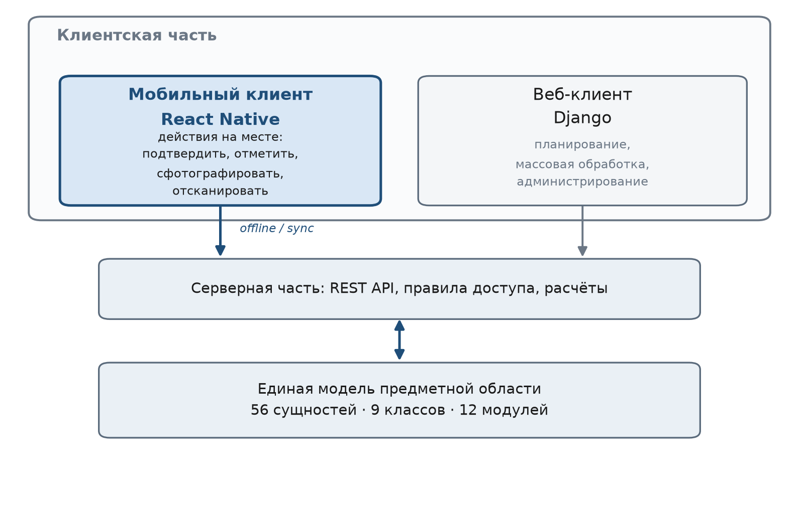
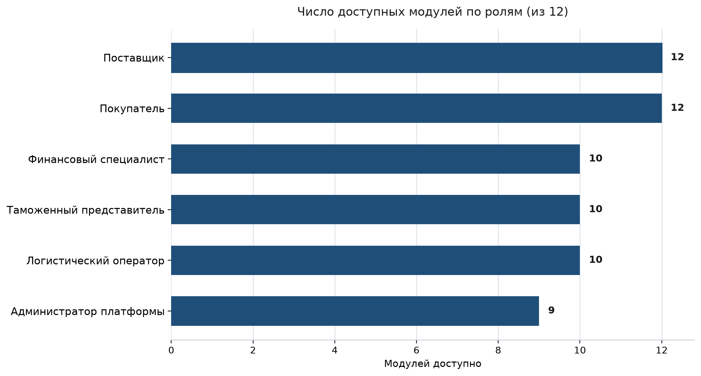
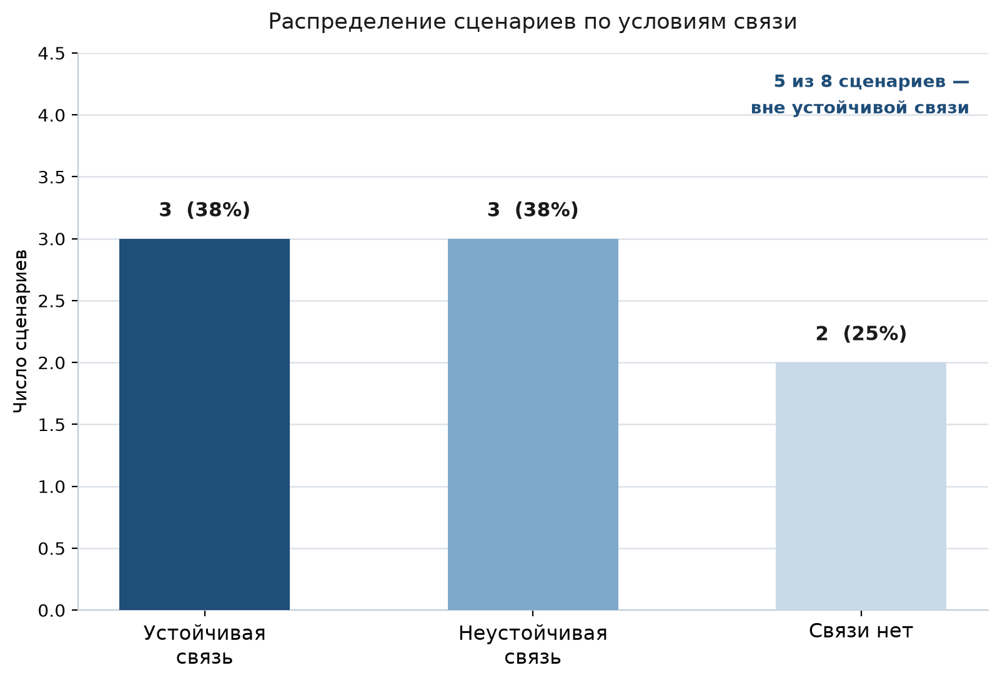
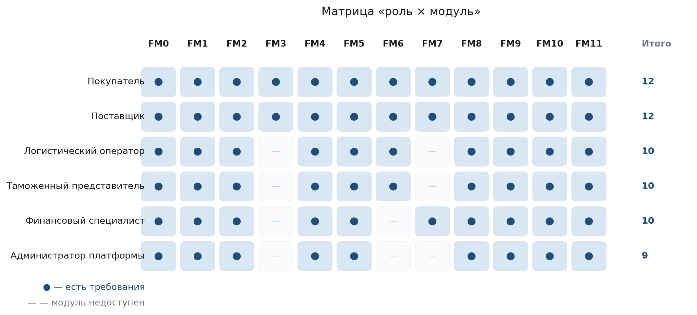
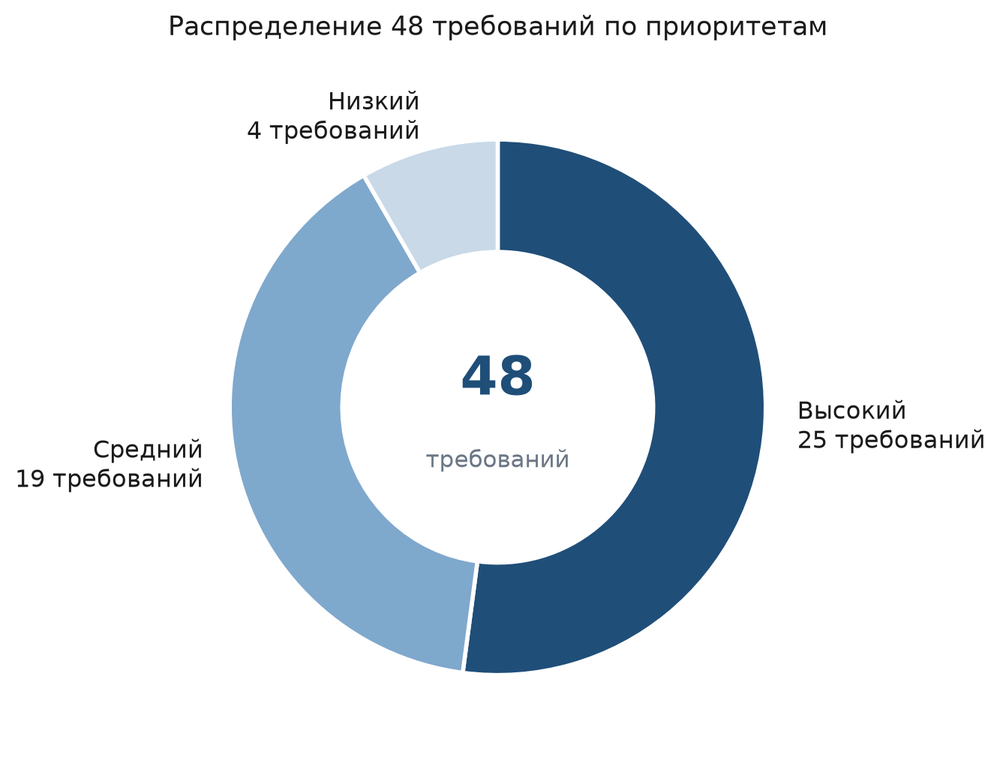

# «Мобильное приложение «SinoRus TradeLite» для трансграничной торговли России и Китая: предметная область и функциональные требования»

- **Курсовой проект:** КУРСОВОЙ ПРОЕКТ
- **Дисциплина:** по дисциплине «Технологии разработки мобильных приложений»
- **Этап:** Этап 1. Описание предметной области и перечень функциональных требований
- **Выполнил:** Выполнил: · Студент группы ПРИк-223 · Янь Яо
- **Принял:** Принял: · асс. каф. ИСПИ · Евдокимов А.О.
- **Место и год:** Владимир, 2026 г.

> Файл сгенерирован из `requirements.py` и `content_ru.py` (`python mdgen.py`). Не редактировать вручную.

## АННОТАЦИЯ

Документ содержит 5 рисунков, 26 таблиц и 12 источников.

Настоящий документ является результатом первого этапа курсового проекта по дисциплине «Технологии разработки мобильных приложений» и решает две задачи: описывает предметную область проекта с точки зрения мобильного контура и формирует перечень функциональных требований к мобильному приложению.

В первой главе даётся характеристика предметной области: место мобильного приложения в проекте «SinoRus TradeLite», шесть групп участников и их интересы, восемь сценариев мобильного использования, сквозной процесс сделки из шести стадий, границы области, обоснование выбора технологической платформы React Native и сопоставление с существующими способами работы.

Во второй главе сформирован перечень из 48 функциональных требований, распределённых по 12 модулям. Приведены сводный реестр требований, матрица «роль × модуль», распределение требований по приоритетам и 12 нефункциональных требований.

Результатом этапа является согласованный перечень требований, который служит исходными данными для проектирования модели данных, экранов и навигации мобильного приложения на последующих этапах.

Ключевые слова: мобильное приложение; предметная область; функциональные требования; нефункциональные требования; трансграничная торговля; React Native; офлайн-режим; сценарии использования

## ABSTRACT

This document is the result of the first stage of the course project in the discipline “Mobile Application Development Technology”. It describes the subject area of the project from the mobile point of view and forms the list of functional requirements for the mobile client of the SinoRus TradeLite platform.

Chapter 1 characterises the subject area: the place of the mobile client in the project, six groups of participants, eight mobile usage scenarios, the end-to-end deal process in six stages, the boundaries of the scope, the rationale for choosing React Native and a comparison with existing ways of working.

Chapter 2 contains 48 functional requirements grouped into 12 modules, together with a consolidated register, a role-to-module matrix, a priority breakdown and 12 non-functional requirements.

The outcome of the stage is an agreed list of requirements that serves as the input for designing the data model, screens and navigation of the mobile application.

Keywords: mobile application; subject area; functional requirements; non-functional requirements; cross-border trade; React Native; offline mode; usage scenarios

## СОДЕРЖАНИЕ

- [АННОТАЦИЯ](#аннотация)
- [ABSTRACT](#abstract)
- [ОПРЕДЕЛЕНИЯ, ОБОЗНАЧЕНИЯ И СОКРАЩЕНИЯ](#определения-обозначения-и-сокращения)
- [ВВЕДЕНИЕ](#введение)
- [1 ОПИСАНИЕ ПРЕДМЕТНОЙ ОБЛАСТИ](#1-описание-предметной-области)
  - [1.1 Общая характеристика предметной области](#11-общая-характеристика-предметной-области)
  - [1.2 Место мобильного приложения в проекте](#12-место-мобильного-приложения-в-проекте)
  - [1.3 Участники и их роли](#13-участники-и-их-роли)
  - [1.4 Сценарии мобильного использования](#14-сценарии-мобильного-использования)
  - [1.5 Сквозной процесс сделки в мобильном приложении](#15-сквозной-процесс-сделки-в-мобильном-приложении)
  - [1.6 Границы предметной области](#16-границы-предметной-области)
  - [1.7 Технологическая платформа](#17-технологическая-платформа)
  - [1.8 Сопоставление с существующими способами работы](#18-сопоставление-с-существующими-способами-работы)
- [2 ПЕРЕЧЕНЬ ФУНКЦИОНАЛЬНЫХ ТРЕБОВАНИЙ](#2-перечень-функциональных-требований)
  - [2.1 Принципы формирования перечня](#21-принципы-формирования-перечня)
  - [2.2 Классификация требований](#22-классификация-требований)
  - [2.3 Требования по модулям](#23-требования-по-модулям)
  - [2.4 Сводный реестр требований](#24-сводный-реестр-требований)
  - [2.5 Матрица «роль × модуль»](#25-матрица-роль--модуль)
  - [2.6 Приоритеты и очерёдность реализации](#26-приоритеты-и-очерёдность-реализации)
  - [2.7 Нефункциональные требования](#27-нефункциональные-требования)
- [ЗАКЛЮЧЕНИЕ](#заключение)
- [СПИСОК ИСПОЛЬЗОВАННЫХ ИСТОЧНИКОВ](#список-использованных-источников)
- [ПРИЛОЖЕНИЕ А (Глоссарий)](#приложение-а-глоссарий)
- [ПРИЛОЖЕНИЕ Б (Реестр требований по модулям)](#приложение-б-реестр-требований-по-модулям)

## ОПРЕДЕЛЕНИЯ, ОБОЗНАЧЕНИЯ И СОКРАЩЕНИЯ

| Сокращение | Расшифровка |
|---|---|
| АПК | аппаратно-программный комплекс |
| ГОСТ | государственный стандарт |
| ЕАЭС | Евразийский экономический союз |
| ИС | информационная система |
| НФТ | нефункциональные требования |
| ПЗ | пояснительная записка |
| ПО | программное обеспечение |
| СУБД | система управления базами данных |
| ТЗ | техническое задание |
| ФТ | функциональные требования |
| API | Application Programming Interface — программный интерфейс приложения |
| APNs | Apple Push Notification service — служба push-уведомлений Apple |
| FCM | Firebase Cloud Messaging — служба push-уведомлений Google |
| QR | Quick Response — тип двухмерного штрихкода |
| RFQ | Request for Quotation — запрос коммерческого предложения |
| TLS | Transport Layer Security — протокол защищённого обмена данными |
| UI | User Interface — пользовательский интерфейс |

## ВВЕДЕНИЕ

Проект «SinoRus TradeLite» представляет собой лёгкую платформу совместной работы для трансграничной торговли России и Китая. Веб-версия платформы, разработанная ранее, охватывает полный рабочий цикл сделки: от запроса цены до сверки расчётов. Она объединяет 43 страницы в 12 модулях и опирается на 56 сущностей предметной области, распределённых по девяти классам.

Опыт работы с веб-версией показал, что существенная часть операций совершается не за рабочим столом. Менеджер поставщика находится на выставке, кладовщик — на складе, таможенный представитель — в пункте пропуска, руководитель — в командировке. В этих условиях рабочее место недоступно, а канал связи неустойчив или отсутствует вовсе. Веб-клиент, рассчитанный на большой экран и стабильное подключение, в таких ситуациях оказывается неудобным.

Настоящий документ открывает этап разработки мобильного клиента и решает две задачи: описать предметную область проекта с точки зрения мобильного контура и сформировать перечень функциональных требований к мобильному приложению.

Для достижения поставленной цели необходимо решить следующие задачи:

1. охарактеризовать предметную область и выделить её мобильную специфику;
2. определить место мобильного приложения в проекте и его границы по отношению к веб-версии;
3. выявить группы участников и их интересы;
4. описать сценарии мобильного использования и условия связи, в которых они протекают;
5. обосновать выбор технологической платформы;
6. сформировать, классифицировать и приоритизировать перечень функциональных требований;
7. установить нефункциональные требования к приложению.

Документ состоит из двух глав. Первая глава посвящена описанию предметной области, вторая — перечню функциональных требований. В заключении подводятся итоги этапа и определяются задачи следующего.

## 1 ОПИСАНИЕ ПРЕДМЕТНОЙ ОБЛАСТИ

### 1.1 Общая характеристика предметной области

Предметная область проекта — слой кооперации между российскими и китайскими участниками трансграничной торговли. Под слоем кооперации понимается функциональный уровень, который располагается между торговыми субъектами и исполнителями — перевозчиками, таможенными представителями, складами — и сводит воедино сведения о сделке, её документах и её текущем состоянии.

Сделка в этой области проходит шесть последовательных стадий: запрос, предложение, заказ, исполнение, оформление документов и перевозка, расчёты. Каждая стадия порождает собственный набор данных и документов, а участники сделки находятся в разных странах, говорят на разных языках и работают в разных правовых режимах.

Особенности области, непосредственно определяющие требования к программному обеспечению, перечислены ниже.

- двуязычие: каждая сделка сопровождается перепиской и документами на русском и китайском языках, при этом автоматический перевод обязателен для обеих сторон;
- длинная логистика: между отгрузкой и приёмкой проходят недели, груз пересекает несколько пунктов пропуска, а состояние сделки меняется без участия офисных сотрудников;
- высокая доля документов: коммерческий инвойс, упаковочный лист, контракт, транспортная накладная, сертификаты происхождения и соответствия — полнота комплекта критична для прохождения таможни;
- распределённость участников: покупатель, поставщик, перевозчик и таможенный представитель работают в разных организациях и географических точках;
- высокая цена ошибки: неверная дата, отсутствующий сертификат или несогласованное количество приводят к простою груза и прямым финансовым потерям.

В рамках проекта ранее была разработана веб-версия платформы, реализующая полный рабочий цикл сделки. Однако веб-клиент предполагает рабочее место, большой экран и стабильное подключение к сети. Настоящий документ рассматривает ту же предметную область с другой стороны — со стороны мобильного контура — и определяет, какие именно задачи должны решаться с телефона.

### 1.2 Место мобильного приложения в проекте

Проект строится по трёхзвенной схеме: единая серверная часть, веб-клиент и мобильный клиент. Серверная часть хранит данные и правила их обработки, поэтому обе клиентские части работают с одной и той же моделью предметной области и не могут расходиться в трактовке сущностей.

Разделение обязанностей между клиентами основано на характере действия, а не на наборе доступных данных.

- веб-клиент предназначен для планирования, массовой обработки и администрирования: ведение номенклатуры, настройка справочников, построение отчётов, работа с шаблонами договоров;
- мобильный клиент предназначен для действий «здесь и сейчас»: подтвердить, отметить, сфотографировать, отсканировать, согласовать, сообщить;
- общими для обоих клиентов остаются данные, справочники, права доступа и правила расчёта.

*Рисунок 1 – Место мобильного приложения в архитектуре проекта*

Как показано на рисунке 1, мобильный клиент не дублирует веб-клиент, а обслуживает собственный класс ситуаций. Соответствие модулей мобильного приложения модулям веб-версии приведено в таблице 1.

**Таблица 1 – Соответствие модулей мобильного приложения модулям веб-версии**

| Модуль | Название в мобильном приложении | Модуль веб-версии | Название в веб-версии |
|---|---|---|---|
| FM0 | Общие экраны и навигация | M0 | Общие страницы |
| FM1 | Аутентификация и профиль | M1 | Предприятие и аккаунт |
| FM2 | Главный экран и задачи | M8 | Задачи и напоминания |
| FM3 | Запросы и предложения | M3 | Запросы и предложения |
| FM4 | Заказы и исполнение | M4 | Заказы |
| FM5 | Документы и сканирование | M6 | Документы и соответствие |
| FM6 | Логистика и отслеживание | M5 | Логистика и пункты пропуска |
| FM7 | Расчёты и сверка | M10 | Расчёты и сверка |
| FM8 | Сообщения и перевод | M7 | Двуязычное общение |
| FM9 | Уведомления и push | M8 | Задачи и напоминания |
| FM10 | Офлайн-режим и синхронизация | — | — |
| FM11 | Настройки и администрирование | M11 | Администрирование |

> **Примечание.** Модуль FM10 «Офлайн-режим и синхронизация» не имеет соответствия в веб-версии: работа без сети и очередь отложенных операций являются свойством именно мобильного клиента. Модули FM2 и FM9 опираются на модуль M8 веб-версии, отвечающий за задачи и напоминания.

### 1.3 Участники и их роли

В предметной области выделяются шесть групп участников. Принадлежность к группе определяет набор доступных модулей и объём видимых данных: пользователь одной организации не видит сделки другой, если не является их участником.

**Таблица 2 – Роли пользователей мобильного приложения**

| Код | Роль | Описание |
|---|---|---|
| R1 | Покупатель | Китайская или российская компания, закупающая товар у контрагента из другой страны. Инициирует запросы, сравнивает предложения, подтверждает заказ и принимает поставку. |
| R2 | Поставщик | Компания-продавец. Ведёт номенклатуру, отвечает на запросы, подтверждает заказы, отмечает этапы и отгружает партии. |
| R3 | Логистический оператор | Перевозчик или экспедитор. Организует доставку, ведёт статусы перевозки и фиксирует прохождение пунктов пропуска. |
| R4 | Таможенный представитель | Специалист по таможенному оформлению. Проверяет комплектность и срок действия документов, сопровождает груз при досмотре. |
| R5 | Финансовый специалист | Сотрудник, отвечающий за выставление счетов, подтверждение поступлений и сверку расчётов по заказам. |
| R6 | Администратор платформы | Сотрудник платформы. Ведёт справочники, управляет пользователями и правами, просматривает журнал действий. |

Распределение модулей между ролями не является равномерным. Покупатель и поставщик участвуют в наибольшем числе модулей, поскольку именно они ведут сделку; логистический оператор и таможенный представитель сосредоточены на перевозке и документах; финансовый специалист работает с расчётами; администратор платформы обслуживает справочники и права доступа. Соответствие ролей и модулей показано на рисунке 2.

*Рисунок 2 – Роли пользователей и доступные им модули*

### 1.4 Сценарии мобильного использования

Мобильное приложение востребовано там, где действие совершается вне рабочего места. По результатам анализа предметной области выделены восемь характерных сценариев. Они приведены в таблице 3.

**Таблица 3 – Сценарии мобильного использования**

| Код | Сценарий | Описание | Роли | Условия связи |
|---|---|---|---|---|
| SC-01 | Стенд на отраслевой выставке | Менеджер поставщика на стенде получает запрос от китайского покупателя, сканирует QR-код визитки и отправляет предложение по трём позициям прямо с телефона. | Покупатель, Поставщик | Неустойчивая |
| SC-02 | Приёмка на складе | Кладовщик принимает партию, сканирует штрих-коды коробок и отмечает этап исполнения; в подвале склада нет связи, поэтому операции уходят в очередь. | Поставщик, Логистический оператор | Отсутствует |
| SC-03 | Досмотр в пункте пропуска | Таможенный представитель при досмотре открывает комплект документов с телефона и проверяет срок действия сертификатов. | Таможенный представитель | Неустойчивая |
| SC-04 | Командировка поставщика | Сотрудник в командировке согласует изменение условий сделки в диалоге приложения с автоматическим переводом на китайский язык. | Поставщик | Есть |
| SC-05 | Подписание документов вне офиса | Руководитель фотографирует подписанный контракт и загружает его в карточку заказа, находясь у контрагента. | Покупатель, Поставщик | Есть |
| SC-06 | Согласование в транспорте | Сотрудник в метро подтверждает предложение и назначает этапы, пользуясь заранее загруженными данными без сети. | Покупатель | Отсутствует |
| SC-07 | Уточнение условий в цеху | Мастер уточняет фактическое количество готовой продукции и отмечает отгрузку партии, не выходя из цеха. | Поставщик | Неустойчивая |
| SC-08 | Экстренное реагирование на инцидент | При повреждении груза логистический оператор регистрирует инцидент с фотографиями; уведомление приходит покупателю и таможенному представителю. | Покупатель, Логистический оператор, Таможенный представитель | Есть |

Существенная часть сценариев протекает при неустойчивой связи или полном её отсутствии: складские помещения, подвальные этажи, участки трассы между пунктами пропуска. Это обстоятельство является главным отличием мобильного клиента от веб-версии и определяет требования к офлайн-режиму. Распределение сценариев по условиям связи приведено на рисунке 3.

*Рисунок 3 – Распределение сценариев использования по условиям связи*

> **Примечание.** Из восьми сценариев только три протекают при устойчивом подключении. Остальные пять требуют либо полной автономной работы, либо устойчивости к перерывам связи, что делает офлайн-режим обязательным, а не дополнительным свойством приложения.

### 1.5 Сквозной процесс сделки в мобильном приложении

Все шесть стадий сделки представлены в мобильном приложении, однако с разной полнотой. Стадии, связанные с принятием решений и фиксацией фактов, реализуются полностью; стадии, требующие массовой обработки данных, выполняются только в объёме, необходимом для контроля. Соответствие стадий и действий приведено в таблице 4.

**Таблица 4 – Стадии сделки и действия в мобильном приложении**

| Стадия | Название | Содержание | Действия в мобильном приложении |
|---|---|---|---|
| 1 | Запрос | Формулирование потребности и отправка запроса поставщику | Создание запроса из каталога, съёмка образца товара |
| 2 | Предложение | Ответ поставщика с ценами, сроками и условиями поставки | Просмотр и сравнение предложений, подтверждение выбранного |
| 3 | Заказ | Фиксация согласованных условий и создание заказа | Проверка карточки заказа, согласование этапов |
| 4 | Исполнение | Производство или комплектация, отгрузка партиями | Отметка этапов, подтверждение отгрузки, регистрация инцидентов |
| 5 | Документы и перевозка | Оформление документов, досмотр и перевозка до места назначения | Сканирование кодов, съёмка документов, контроль комплектности, отслеживание перевозки |
| 6 | Расчёты | Выставление счетов, поступление средств и сверка расчётов | Просмотр счетов, подтверждение поступления, сверка по заказу |

### 1.6 Границы предметной области

Чтобы мобильное приложение оставалось быстрым и предсказуемым, часть операций сознательно вынесена за его границы и закреплена за веб-версией. Перечень таких операций с указанием причин приведён в таблице 5.

**Таблица 5 – Операции, вынесенные за границы мобильного приложения**

| Операция | Причина вынесения за границы приложения |
|---|---|
| Массовый импорт и экспорт данных | Требует разбора больших файлов и длительной работы; выполняется в веб-версии. |
| Сложные аналитические отчёты | Множественные срезы и выгрузки неудобны на небольшом экране. |
| Редактирование шаблонов договоров | Работа с печатными формами требует полноценного редактора и проверки вёрстки. |
| Настройка интеграций и API | Операция выполняется однократно и требует доступа к секретам; оставлена веб-версии. |
| Пакетная обработка документов | Массовые операции удобнее выполнять за рабочим столом. |

> **Примечание.** Вынесение операций за границы приложения не означает потери данных: результаты работы в веб-версии становятся доступны в мобильном приложении в режиме просмотра после очередной синхронизации.

### 1.7 Технологическая платформа

В качестве технологической платформы выбран кроссплатформенный каркас React Native. Выбор обусловлен следующими соображениями:

- одна кодовая база для Android и iOS при ограниченных сроках курсового проекта;
- зрелая экосистема готовых модулей для работы с камерой, push-уведомлениями и локальным хранилищем;
- возможность переиспользовать подходы и знание языка JavaScript, уже применённые в веб-части проекта;
- наличие инструментов модульного и сквозного тестирования интерфейса.

Состав технологического стека приведён в таблице 6.

**Таблица 6 – Технологический стек мобильного приложения**

| Компонент | Назначение |
|---|---|
| React Native | Кроссплатформенный каркас: одна кодовая база для Android и iOS. |
| TypeScript | Строгая типизация и автодополнение; снижает число ошибок на этапе разработки. |
| React Navigation | Нижняя навигация, стек экранов и переходы по ссылкам. |
| Redux Toolkit и RTK Query | Единое состояние приложения и кэширование серверных данных с переиспользованием запросов. |
| SQLite (op-sqlite) | Локальное хранилище для офлайн-режима и очереди отложенных операций. |
| Vision Camera | Сканирование штрих- и QR-кодов и съёмка документов с обработкой кадра. |
| Firebase Cloud Messaging и APNs | Доставка push-уведомлений на Android и iOS. |
| i18next | Локализация интерфейса на русский, китайский и английский языки. |
| Keychain и Keystore | Защищённое хранение токенов доступа на устройстве. |
| Jest и Detox | Модульное тестирование логики и сквозные тесты интерфейса. |

### 1.8 Сопоставление с существующими способами работы

До появления мобильного клиента участники сделки решали мобильные задачи подручными средствами. Каждый из этих способов обладает существенным недостатком.

- телефонные звонки и сторонние мессенджеры: договорённость достигается быстро, но не привязывается к сделке, не сохраняется в истории заказа и не может быть предъявлена при разборе расхождений;
- электронная почта: переписка сохраняется, однако вложение и ответ разнесены во времени, а поиск нужного письма по номеру заказа затруднён;
- веб-версия платформы, открытая в браузере телефона: интерфейс рассчитан на большой экран, ввод данных с экранной клавиатуры затруднён, а при отсутствии сети работа невозможна вовсе;
- готовые мобильные клиенты учётных систем: требуют внедрения и настройки, не поддерживают двуязычную переписку внутри сделки и плохо приспособлены к специфике трансграничных документов.

Мобильное приложение проекта устраняет перечисленные недостатки: переписка ведётся внутри сделки и сохраняется вместе с ней, автоматический перевод снимает языковой барьер, а офлайн-режим позволяет фиксировать факты там, где связи нет. При этом приложение не заменяет веб-версию, а дополняет её.

## 2 ПЕРЕЧЕНЬ ФУНКЦИОНАЛЬНЫХ ТРЕБОВАНИЙ

### 2.1 Принципы формирования перечня

Перечень функциональных требований сформирован на основе описания предметной области и сценариев использования. При его составлении соблюдались следующие принципы.

1. каждое требование имеет уникальный код и относится ровно к одному модулю;
2. формулировка требования описывает наблюдаемое поведение системы, а не способ его реализации;
3. для каждого требования указаны роли, заинтересованные в его выполнении, и приоритет;
4. требование проверяемо: результат его выполнения можно установить без обращения к исходному коду;
5. перечень не дублирует требования веб-версии, а дополняет их мобильной спецификой.

### 2.2 Классификация требований

Всего сформировано 48 функциональных требований, распределённых по 12 модулям. Модуль объединяет требования, относящиеся к одной области работы пользователя, и соответствует отдельному разделу нижней навигации или самостоятельному экрану. Распределение требований по модулям и приоритетам приведено в таблице 7.

**Таблица 7 – Классификация функциональных требований по модулям**

| Модуль | Название | Кол-во | Высокий | Средний | Низкий | Модуль веб-версии |
|---|---|---|---|---|---|---|
| FM0 | Общие экраны и навигация | 3 | 2 | 1 | 0 | Общие страницы |
| FM1 | Аутентификация и профиль | 4 | 2 | 2 | 0 | Предприятие и аккаунт |
| FM2 | Главный экран и задачи | 4 | 2 | 2 | 0 | Задачи и напоминания |
| FM3 | Запросы и предложения | 4 | 3 | 1 | 0 | Запросы и предложения |
| FM4 | Заказы и исполнение | 5 | 3 | 2 | 0 | Заказы |
| FM5 | Документы и сканирование | 5 | 3 | 2 | 0 | Документы и соответствие |
| FM6 | Логистика и отслеживание | 4 | 1 | 1 | 2 | Логистика и пункты пропуска |
| FM7 | Расчёты и сверка | 4 | 1 | 2 | 1 | Расчёты и сверка |
| FM8 | Сообщения и перевод | 4 | 3 | 0 | 1 | Двуязычное общение |
| FM9 | Уведомления и push | 3 | 1 | 2 | 0 | Задачи и напоминания |
| FM10 | Офлайн-режим и синхронизация | 4 | 3 | 1 | 0 | — |
| FM11 | Настройки и администрирование | 4 | 1 | 3 | 0 | Администрирование |
| Итого |  | 48 | 25 | 19 | 4 |  |

Наибольшее число требований приходится на модули FM4 «Заказы и исполнение» и FM5 «Документы и сканирование» — по пять требований. Это отражает характер мобильного использования: именно фиксация фактов исполнения и работа с документами совершаются вне рабочего места. Модуль FM9 «Уведомления и push» содержит три требования, поскольку часть его функциональности обеспечивается системными средствами операционной системы.

### 2.3 Требования по модулям

Ниже приведены требования по каждому модулю. В таблицах указаны код требования, его наименование, содержание, роли, заинтересованные в выполнении, и приоритет.

#### 2.3.1 Требования модуля FM0 «Общие экраны и навигация»

Модуль FM0 «Общие экраны и навигация» — 3 требований. Экраны, которые пользователь видит при каждом запуске: заставка, нижняя навигация и глобальный поиск. Задают каркас, внутри которого работают остальные модули.

**Таблица 8 – Требования модуля FM0 «Общие экраны и навигация»**

| Код | Требование | Содержание | Роли | Приоритет |
|---|---|---|---|---|
| FR-001 | Запуск и первичная загрузка | Приложение запускается, проверяет актуальность версии, восстанавливает сохранённую сессию и показывает главный экран либо экран входа. | Покупатель, Поставщик, Логистический оператор, Таможенный представитель, Финансовый специалист, Администратор платформы | Высокий |
| FR-002 | Нижняя навигация по разделам | Постоянная нижняя панель с четырьмя основными разделами (Работа, Заказы, Сообщения, Профиль); текущий раздел подсвечен, выбранная позиция сохраняется между запусками. | Покупатель, Поставщик, Логистический оператор, Таможенный представитель, Финансовый специалист, Администратор платформы | Высокий |
| FR-003 | Глобальный поиск | Поиск по номерам заказов и запросов, контрагентам и товарам из единого поля; результаты группируются по типу объекта. | Покупатель, Поставщик, Логистический оператор, Таможенный представитель, Финансовый специалист, Администратор платформы | Средний |

#### 2.3.2 Требования модуля FM1 «Аутентификация и профиль»

Модуль FM1 «Аутентификация и профиль» — 4 требований. Вход в приложение, быстрый доступ по биометрии, просмотр и правка профиля, переключение между организациями, к которым привязан пользователь.

**Таблица 9 – Требования модуля FM1 «Аутентификация и профиль»**

| Код | Требование | Содержание | Роли | Приоритет |
|---|---|---|---|---|
| FR-004 | Вход по логину и паролю | Аутентификация по логину и паролю с ограничением числа попыток; при успешном входе выдаётся токен доступа с ограниченным сроком действия. | Покупатель, Поставщик, Логистический оператор, Таможенный представитель, Финансовый специалист, Администратор платформы | Высокий |
| FR-005 | Быстрый вход по биометрии | Повторный вход по отпечатку пальца или распознаванию лица без ввода пароля; биометрия включается только после первого успешного входа с паролем. | Покупатель, Поставщик, Логистический оператор, Таможенный представитель, Финансовый специалист, Администратор платформы | Средний |
| FR-006 | Просмотр и редактирование профиля | Просмотр фамилии и инициалов, должности, контактов и аватара; редактирование контактных данных и загрузка фотографии. | Покупатель, Поставщик, Логистический оператор, Таможенный представитель, Финансовый специалист, Администратор платформы | Средний |
| FR-007 | Переключение организации | Переключение между организациями, к которым привязан пользователь; после переключения обновляются доступные данные и права. | Покупатель, Поставщик, Логистический оператор, Таможенный представитель, Финансовый специалист, Администратор платформы | Высокий |

#### 2.3.3 Требования модуля FM2 «Главный экран и задачи»

Модуль FM2 «Главный экран и задачи» — 4 требований. Сводка ключевых показателей, список задач на сегодня, быстрые действия и лента событий по сделкам. Точка входа в ежедневную работу.

**Таблица 10 – Требования модуля FM2 «Главный экран и задачи»**

| Код | Требование | Содержание | Роли | Приоритет |
|---|---|---|---|---|
| FR-008 | Сводка ключевых показателей | Карточки с числом активных заказов, суммой к оплате, ближайшими сроками и количеством просроченных задач; данные обновляются при возврате на экран. | Покупатель, Поставщик, Финансовый специалист | Высокий |
| FR-009 | Список задач на сегодня | Список задач с сортировкой по сроку: подтвердить предложение, отметить этап, загрузить документ, подтвердить платёж. | Покупатель, Поставщик, Логистический оператор, Таможенный представитель, Финансовый специалист, Администратор платформы | Высокий |
| FR-010 | Быстрые действия | Плитки быстрого перехода к частым действиям: сканировать код, создать запрос, загрузить документ, написать контрагенту. | Покупатель, Поставщик, Логистический оператор, Таможенный представитель | Средний |
| FR-011 | Лента событий по сделкам | Хронологическая лента изменений по заказам пользователя с указанием автора и времени события. | Покупатель, Поставщик, Логистический оператор, Таможенный представитель, Финансовый специалист, Администратор платформы | Средний |

#### 2.3.4 Требования модуля FM3 «Запросы и предложения»

Модуль FM3 «Запросы и предложения» — 4 требований. Работа с запросами и ответами на них: просмотр списка, создание запроса прямо с телефона, сравнение предложений и подтверждение выбранного.

**Таблица 11 – Требования модуля FM3 «Запросы и предложения»**

| Код | Требование | Содержание | Роли | Приоритет |
|---|---|---|---|---|
| FR-012 | Просмотр списка запросов | Список запросов с фильтрами по статусу, контрагенту и дате; отображаются число позиций и срок ответа. | Покупатель, Поставщик | Высокий |
| FR-013 | Создание запроса с телефона | Создание запроса из шаблона: выбор товаров из каталога, указание количества и срока ответа, отправка контрагенту. | Покупатель | Высокий |
| FR-014 | Просмотр и сравнение предложений | Просмотр поступивших предложений и их сравнение по цене, сроку и условиям поставки в одной таблице. | Покупатель | Высокий |
| FR-015 | Подтверждение предложения | Подтверждение выбранного предложения с фиксацией его версии; после подтверждения автоматически создаётся заказ. | Покупатель | Средний |

#### 2.3.5 Требования модуля FM4 «Заказы и исполнение»

Модуль FM4 «Заказы и исполнение» — 5 требований. Список заказов с фильтрами, карточка заказа, отметка этапов исполнения, подтверждение отгрузки партии и регистрация инцидентов.

**Таблица 12 – Требования модуля FM4 «Заказы и исполнение»**

| Код | Требование | Содержание | Роли | Приоритет |
|---|---|---|---|---|
| FR-016 | Список заказов с фильтрами | Список заказов с фильтрами по роли, статусу, контрагенту и периоду; поддерживается поиск по номеру заказа. | Покупатель, Поставщик, Логистический оператор, Таможенный представитель, Финансовый специалист, Администратор платформы | Высокий |
| FR-017 | Карточка заказа | Полная информация по заказу: позиции, суммы, этапы, партии, документы и связанные сообщения на одном экране с вкладками. | Покупатель, Поставщик, Логистический оператор, Таможенный представитель, Финансовый специалист, Администратор платформы | Высокий |
| FR-018 | Отметка этапа исполнения | Отметка фактического прохождения этапа с указанием даты, комментария и фотоподтверждения; этап переводится в состояние «выполнен». | Поставщик, Логистический оператор | Высокий |
| FR-019 | Подтверждение отгрузки партии | Формирование партии из позиций заказа, указание количества и даты отгрузки, привязка транспортных документов. | Поставщик, Логистический оператор | Средний |
| FR-020 | Регистрация инцидента | Фиксация инцидента по заказу: тип, описание, фотографии и затронутые позиции; инцидент попадает в список задач ответственного сотрудника. | Покупатель, Поставщик, Логистический оператор, Таможенный представитель | Средний |

#### 2.3.6 Требования модуля FM5 «Документы и сканирование»

Модуль FM5 «Документы и сканирование» — 5 требований. Сканирование штрих- и QR-кодов, съёмка и загрузка документов, контроль комплектности, напоминания об истечении срока и офлайн-просмотр ранее загруженных файлов.

**Таблица 13 – Требования модуля FM5 «Документы и сканирование»**

| Код | Требование | Содержание | Роли | Приоритет |
|---|---|---|---|---|
| FR-021 | Сканирование штрих- и QR-кодов | Сканирование камерой штрих-кодов товара и QR-кодов документов; распознанный код сразу открывает связанный объект. | Поставщик, Логистический оператор, Таможенный представитель | Высокий |
| FR-022 | Съёмка и загрузка документов | Съёмка документа камерой с автоматической обрезкой и повышением контраста, выбор вида документа и загрузка на сервер. | Покупатель, Поставщик, Логистический оператор, Таможенный представитель | Высокий |
| FR-023 | Контроль комплектности | Проверка полноты комплекта документов по заказу или партии с подсветкой отсутствующих позиций. | Таможенный представитель | Высокий |
| FR-024 | Напоминания об истечении срока | Напоминания о документах и сертификатах, срок действия которых истекает в ближайшие тридцать дней. | Покупатель, Поставщик, Таможенный представитель | Средний |
| FR-025 | Офлайн-просмотр документов | Просмотр ранее загруженных документов без подключения к сети; файлы хранятся в локальном кэше устройства. | Покупатель, Поставщик, Логистический оператор, Таможенный представитель, Финансовый специалист, Администратор платформы | Средний |

#### 2.3.7 Требования модуля FM6 «Логистика и отслеживание»

Модуль FM6 «Логистика и отслеживание» — 4 требований. Отслеживание статуса перевозки, карта маршрута с пунктами пропуска, ориентировочный расчёт стоимости доставки и связь с водителем.

**Таблица 14 – Требования модуля FM6 «Логистика и отслеживание»**

| Код | Требование | Содержание | Роли | Приоритет |
|---|---|---|---|---|
| FR-026 | Отслеживание статуса перевозки | Текущий статус перевозки, история переходов и расчётное время прибытия по каждой партии. | Покупатель, Поставщик, Логистический оператор | Высокий |
| FR-027 | Карта маршрута и пунктов пропуска | Отображение маршрута и пройденных пунктов пропуска на карте с переходом к сведениям о пункте. | Покупатель, Логистический оператор, Таможенный представитель | Средний |
| FR-028 | Расчёт ориентировочной стоимости доставки | Ориентировочный расчёт стоимости доставки по весу, объёму и направлению до оформления заявки. | Покупатель, Поставщик | Низкий |
| FR-029 | Связь с водителем | Звонок или сообщение водителю по номеру, указанному в карточке перевозки. | Покупатель, Логистический оператор | Низкий |

#### 2.3.8 Требования модуля FM7 «Расчёты и сверка»

Модуль FM7 «Расчёты и сверка» — 4 требований. Просмотр счетов и платежей, подтверждение поступления средств, сверка расчётов по заказу и выгрузка счёта в PDF.

**Таблица 15 – Требования модуля FM7 «Расчёты и сверка»**

| Код | Требование | Содержание | Роли | Приоритет |
|---|---|---|---|---|
| FR-030 | Просмотр счетов и платежей | Список счетов с суммами, сроками и статусом оплаты; переход к связанному заказу. | Покупатель, Поставщик, Финансовый специалист | Высокий |
| FR-031 | Подтверждение поступления платежа | Отметка факта поступления средств с указанием даты, суммы и номера платёжного документа. | Финансовый специалист | Средний |
| FR-032 | Сверка расчётов по заказу | Сопоставление начислений и поступлений по заказу с выводом расхождения и итогового сальдо. | Покупатель, Финансовый специалист | Средний |
| FR-033 | Выгрузка счёта в PDF | Формирование и выгрузка счёта или акта сверки в формате PDF для отправки контрагенту. | Финансовый специалист | Низкий |

#### 2.3.9 Требования модуля FM8 «Сообщения и перевод»

Модуль FM8 «Сообщения и перевод» — 4 требований. Диалоги, привязанные к конкретной сделке, отправка текста, фото и файлов, автоматический перевод сообщений и шаблоны типовых фраз.

**Таблица 16 – Требования модуля FM8 «Сообщения и перевод»**

| Код | Требование | Содержание | Роли | Приоритет |
|---|---|---|---|---|
| FR-034 | Диалоги, привязанные к сделке | Переписка ведётся в контексте конкретного заказа или запроса; из диалога доступен переход к самому объекту. | Покупатель, Поставщик, Логистический оператор, Таможенный представитель, Финансовый специалист, Администратор платформы | Высокий |
| FR-035 | Отправка текста, фото и файлов | Отправка текстовых сообщений, снимков и документов; поддерживается съёмка прямо из диалога. | Покупатель, Поставщик, Логистический оператор, Таможенный представитель, Финансовый специалист, Администратор платформы | Высокий |
| FR-036 | Автоматический перевод сообщений | Автоматический перевод входящих и исходящих сообщений между русским и китайским языками с возможностью показа оригинала. | Покупатель, Поставщик, Логистический оператор, Таможенный представитель, Финансовый специалист, Администратор платформы | Высокий |
| FR-037 | Шаблоны типовых сообщений | Набор готовых фраз для типовых ситуаций: уточнение сроков, запрос документов, напоминание об оплате. | Покупатель, Поставщик | Низкий |

#### 2.3.10 Требования модуля FM9 «Уведомления и push»

Модуль FM9 «Уведомления и push» — 3 требований. Push-уведомления о событиях сделки, настройка категорий уведомлений и центр уведомлений внутри приложения.

**Таблица 17 – Требования модуля FM9 «Уведомления и push»**

| Код | Требование | Содержание | Роли | Приоритет |
|---|---|---|---|---|
| FR-038 | Push-уведомления о событиях | Push-уведомления о новых предложениях, смене статуса заказа, истечении срока документа и поступлении платежа. | Покупатель, Поставщик, Логистический оператор, Таможенный представитель, Финансовый специалист, Администратор платформы | Высокий |
| FR-039 | Настройка категорий уведомлений | Включение и выключение отдельных категорий уведомлений и настройка тихих часов. | Покупатель, Поставщик, Логистический оператор, Таможенный представитель, Финансовый специалист, Администратор платформы | Средний |
| FR-040 | Центр уведомлений | История всех уведомлений внутри приложения с переходом к связанному объекту. | Покупатель, Поставщик, Логистический оператор, Таможенный представитель, Финансовый специалист, Администратор платформы | Средний |

#### 2.3.11 Требования модуля FM10 «Офлайн-режим и синхронизация»

Модуль FM10 «Офлайн-режим и синхронизация» — 4 требований. Работа без сети, очередь отложенных операций, автоматическая синхронизация при появлении связи и разрешение конфликтов версий. Модуль, которого нет в веб-версии.

**Таблица 18 – Требования модуля FM10 «Офлайн-режим и синхронизация»**

| Код | Требование | Содержание | Роли | Приоритет |
|---|---|---|---|---|
| FR-041 | Работа без сети | Основные экраны (список задач, заказы, документы) открываются и читаются без подключения к сети. | Покупатель, Поставщик, Логистический оператор, Таможенный представитель, Финансовый специалист, Администратор платформы | Высокий |
| FR-042 | Очередь отложенных операций | Действия, выполненные без сети, сохраняются в очереди и отправляются на сервер при восстановлении связи. | Покупатель, Поставщик, Логистический оператор, Таможенный представитель, Финансовый специалист, Администратор платформы | Высокий |
| FR-043 | Автоматическая синхронизация | Фоновая синхронизация изменений с указанием времени последнего успешного обмена и возможностью ручного запуска. | Покупатель, Поставщик, Логистический оператор, Таможенный представитель, Финансовый специалист, Администратор платформы | Высокий |
| FR-044 | Разрешение конфликтов версий | При расхождении локальной и серверной версий объекта пользователю предлагается выбор с пояснением различий. | Покупатель, Поставщик, Логистический оператор, Таможенный представитель, Финансовый специалист, Администратор платформы | Средний |

#### 2.3.12 Требования модуля FM11 «Настройки и администрирование»

Модуль FM11 «Настройки и администрирование» — 4 требований. Выбор языка интерфейса, ведение справочников, журнал действий пользователя и управление пользователями и правами.

**Таблица 19 – Требования модуля FM11 «Настройки и администрирование»**

| Код | Требование | Содержание | Роли | Приоритет |
|---|---|---|---|---|
| FR-045 | Выбор языка интерфейса | Переключение языка интерфейса между русским, китайским и английским без перезапуска приложения. | Покупатель, Поставщик, Логистический оператор, Таможенный представитель, Финансовый специалист, Администратор платформы | Высокий |
| FR-046 | Управление справочниками | Просмотр и правка справочников: виды документов, единицы измерения, условия поставки. | Администратор платформы | Средний |
| FR-047 | Журнал действий пользователя | Просмотр журнала ключевых действий пользователей с фильтрами по дате, пользователю и типу операции. | Администратор платформы | Средний |
| FR-048 | Управление пользователями и правами | Добавление пользователей, назначение ролей и блокировка учётных записей. | Администратор платформы | Средний |

### 2.4 Сводный реестр требований

Сводный реестр объединяет все 48 требований в единый список, упорядоченный по коду. Реестр приведён в таблице 20.

**Таблица 20 – Сводный реестр функциональных требований**

| Код | Модуль | Требование | Роли | Приоритет |
|---|---|---|---|---|
| FR-001 | FM0 | Запуск и первичная загрузка | R1, R2, R3, R4, R5, R6 | Высокий |
| FR-002 | FM0 | Нижняя навигация по разделам | R1, R2, R3, R4, R5, R6 | Высокий |
| FR-003 | FM0 | Глобальный поиск | R1, R2, R3, R4, R5, R6 | Средний |
| FR-004 | FM1 | Вход по логину и паролю | R1, R2, R3, R4, R5, R6 | Высокий |
| FR-005 | FM1 | Быстрый вход по биометрии | R1, R2, R3, R4, R5, R6 | Средний |
| FR-006 | FM1 | Просмотр и редактирование профиля | R1, R2, R3, R4, R5, R6 | Средний |
| FR-007 | FM1 | Переключение организации | R1, R2, R3, R4, R5, R6 | Высокий |
| FR-008 | FM2 | Сводка ключевых показателей | R1, R2, R5 | Высокий |
| FR-009 | FM2 | Список задач на сегодня | R1, R2, R3, R4, R5, R6 | Высокий |
| FR-010 | FM2 | Быстрые действия | R1, R2, R3, R4 | Средний |
| FR-011 | FM2 | Лента событий по сделкам | R1, R2, R3, R4, R5, R6 | Средний |
| FR-012 | FM3 | Просмотр списка запросов | R1, R2 | Высокий |
| FR-013 | FM3 | Создание запроса с телефона | R1 | Высокий |
| FR-014 | FM3 | Просмотр и сравнение предложений | R1 | Высокий |
| FR-015 | FM3 | Подтверждение предложения | R1 | Средний |
| FR-016 | FM4 | Список заказов с фильтрами | R1, R2, R3, R4, R5, R6 | Высокий |
| FR-017 | FM4 | Карточка заказа | R1, R2, R3, R4, R5, R6 | Высокий |
| FR-018 | FM4 | Отметка этапа исполнения | R2, R3 | Высокий |
| FR-019 | FM4 | Подтверждение отгрузки партии | R2, R3 | Средний |
| FR-020 | FM4 | Регистрация инцидента | R1, R2, R3, R4 | Средний |
| FR-021 | FM5 | Сканирование штрих- и QR-кодов | R2, R3, R4 | Высокий |
| FR-022 | FM5 | Съёмка и загрузка документов | R1, R2, R3, R4 | Высокий |
| FR-023 | FM5 | Контроль комплектности | R4 | Высокий |
| FR-024 | FM5 | Напоминания об истечении срока | R1, R2, R4 | Средний |
| FR-025 | FM5 | Офлайн-просмотр документов | R1, R2, R3, R4, R5, R6 | Средний |
| FR-026 | FM6 | Отслеживание статуса перевозки | R1, R2, R3 | Высокий |
| FR-027 | FM6 | Карта маршрута и пунктов пропуска | R1, R3, R4 | Средний |
| FR-028 | FM6 | Расчёт ориентировочной стоимости доставки | R1, R2 | Низкий |
| FR-029 | FM6 | Связь с водителем | R1, R3 | Низкий |
| FR-030 | FM7 | Просмотр счетов и платежей | R1, R2, R5 | Высокий |
| FR-031 | FM7 | Подтверждение поступления платежа | R5 | Средний |
| FR-032 | FM7 | Сверка расчётов по заказу | R1, R5 | Средний |
| FR-033 | FM7 | Выгрузка счёта в PDF | R5 | Низкий |
| FR-034 | FM8 | Диалоги, привязанные к сделке | R1, R2, R3, R4, R5, R6 | Высокий |
| FR-035 | FM8 | Отправка текста, фото и файлов | R1, R2, R3, R4, R5, R6 | Высокий |
| FR-036 | FM8 | Автоматический перевод сообщений | R1, R2, R3, R4, R5, R6 | Высокий |
| FR-037 | FM8 | Шаблоны типовых сообщений | R1, R2 | Низкий |
| FR-038 | FM9 | Push-уведомления о событиях | R1, R2, R3, R4, R5, R6 | Высокий |
| FR-039 | FM9 | Настройка категорий уведомлений | R1, R2, R3, R4, R5, R6 | Средний |
| FR-040 | FM9 | Центр уведомлений | R1, R2, R3, R4, R5, R6 | Средний |
| FR-041 | FM10 | Работа без сети | R1, R2, R3, R4, R5, R6 | Высокий |
| FR-042 | FM10 | Очередь отложенных операций | R1, R2, R3, R4, R5, R6 | Высокий |
| FR-043 | FM10 | Автоматическая синхронизация | R1, R2, R3, R4, R5, R6 | Высокий |
| FR-044 | FM10 | Разрешение конфликтов версий | R1, R2, R3, R4, R5, R6 | Средний |
| FR-045 | FM11 | Выбор языка интерфейса | R1, R2, R3, R4, R5, R6 | Высокий |
| FR-046 | FM11 | Управление справочниками | R6 | Средний |
| FR-047 | FM11 | Журнал действий пользователя | R6 | Средний |
| FR-048 | FM11 | Управление пользователями и правами | R6 | Средний |

### 2.5 Матрица «роль × модуль»

Матрица показывает, требования каких модулей затрагивают каждую роль. Знак «●» означает, что в модуле есть хотя бы одно требование, относящееся к данной роли; знак «—» означает, что модуль для этой роли недоступен. Матрица приведена в таблице 21.

**Таблица 21 – Матрица «роль × модуль»**

| Роль | FM0 | FM1 | FM2 | FM3 | FM4 | FM5 | FM6 | FM7 | FM8 | FM9 | FM10 | FM11 | Итого |
|---|---|---|---|---|---|---|---|---|---|---|---|---|---|
| R1 Покупатель | ● | ● | ● | ● | ● | ● | ● | ● | ● | ● | ● | ● | 12 |
| R2 Поставщик | ● | ● | ● | ● | ● | ● | ● | ● | ● | ● | ● | ● | 12 |
| R3 Логистический оператор | ● | ● | ● | — | ● | ● | ● | — | ● | ● | ● | ● | 10 |
| R4 Таможенный представитель | ● | ● | ● | — | ● | ● | ● | — | ● | ● | ● | ● | 10 |
| R5 Финансовый специалист | ● | ● | ● | — | ● | ● | — | ● | ● | ● | ● | ● | 10 |
| R6 Администратор платформы | ● | ● | ● | — | ● | ● | — | — | ● | ● | ● | ● | 9 |
| Итого | 3 | 4 | 4 | 4 | 5 | 5 | 4 | 4 | 4 | 3 | 4 | 4 | 48 |

Матрица показывает, что наибольшее число модулей доступно покупателю и поставщику, поскольку именно они ведут сделку от запроса до расчётов. Роли логистического оператора и таможенного представителя сосредоточены на модулях перевозки и документов, а администратор платформы работает преимущественно с модулем настроек. Наглядно распределение показано на рисунке 4.

*Рисунок 4 – Матрица «роль × модуль»*

### 2.6 Приоритеты и очерёдность реализации

Каждому требованию присвоен приоритет, определяющий очерёдность реализации. Высокий приоритет означает, что без выполнения требования приложение не решает своего основного назначения; средний — что требование повышает удобство и полноту охвата процесса; низкий — что требование полезно, но не влияет на основной сценарий. Распределение требований по приоритетам приведено в таблице 22.

**Таблица 22 – Распределение требований по приоритетам**

| Приоритет | Количество | Доля, % | Очерёдность реализации |
|---|---|---|---|
| Высокий | 25 | 52,1 | Реализуется в первой очереди: без этих требований приложение не выполняет основного назначения. |
| Средний | 19 | 39,6 | Реализуется во второй очереди: повышает удобство и полноту охвата процесса. |
| Низкий | 4 | 8,3 | Реализуется при наличии резерва: полезно, но не влияет на основной сценарий. |
| Итого | 48 | 100,0 |  |

Соотношение приоритетов показано на рисунке 5.

*Рисунок 5 – Распределение требований по приоритетам*

### 2.7 Нефункциональные требования

Помимо функциональных требований, к приложению предъявляются нефункциональные требования, определяющие качество его работы. Они охватывают производительность, совместимость, безопасность, автономность, локализацию и доступность. Перечень нефункциональных требований приведён в таблице 23.

**Таблица 23 – Нефункциональные требования**

| Код | Требование | Критерий приёмки | Приоритет |
|---|---|---|---|
| NFR-01 | Холодный запуск | Не более 3 секунд на среднем устройстве при наличии сети. | Высокий |
| NFR-02 | Отклик интерфейса | Реакция на касание не более 100 мс; прокрутка списков без заметных пропусков кадров. | Высокий |
| NFR-03 | Размер приложения | Установочный пакет не более 80 МБ. | Средний |
| NFR-04 | Поддерживаемые платформы | Android 9 и выше, iOS 14 и выше. | Высокий |
| NFR-05 | Адаптивность вёрстки | Корректное отображение на экранах от 4,7 до 7 дюймов и на планшетах, поддержка книжной и альбомной ориентации. | Средний |
| NFR-06 | Защита канала и токенов | Обмен только по TLS 1.3; токен доступа хранится в Keychain (iOS) или Keystore (Android) и не попадает в журналы. | Высокий |
| NFR-07 | Автономность | Не менее пяти ключевых экранов доступны без подключения к сети. | Высокий |
| NFR-08 | Ограничение кэша | Объём локального кэша не более 300 МБ с автоматической очисткой старых файлов. | Средний |
| NFR-09 | Локализация | Полная поддержка русского, китайского и английского языков, включая форматы дат и чисел. | Высокий |
| NFR-10 | Доступность | Поддержка системного масштабирования шрифта, контрастность не ниже 4,5:1, подписи для элементов управления. | Средний |
| NFR-11 | Расход заряда батареи | Расход заряда при фоновой синхронизации не более 3% в сутки. | Низкий |
| NFR-12 | Логирование и телеметрия | Локальный журнал ошибок и анонимная телеметрия ключевых сценариев с возможностью отключения пользователем. | Низкий |

Особое место среди нефункциональных требований занимают требования к автономности и безопасности. Автономность обеспечивается локальным хранилищем и очередью отложенных операций; безопасность — обязательным шифрованием канала и защищённым хранением токенов доступа на устройстве.

## ЗАКЛЮЧЕНИЕ

В ходе первого этапа курсового проекта были решены две поставленные задачи: описана предметная область проекта с точки зрения мобильного контура и сформирован перечень функциональных требований к мобильному приложению.

В результате описания предметной области установлено следующее. Предметная область представляет собой слой кооперации между российскими и китайскими участниками трансграничной торговли и включает шесть стадий сделки. Мобильный клиент не дублирует веб-версию, а обслуживает собственный класс ситуаций, связанных с действиями вне рабочего места. Выделены шесть групп участников и восемь сценариев мобильного использования, причём пять из восьми сценариев протекают при неустойчивой связи или полном её отсутствии. За границы приложения сознательно вынесены пять операций, требующих массовой обработки данных.

Сформирован перечень из 48 функциональных требований, распределённых по 12 модулям: 25 требований имеют высокий приоритет, 19 — средний и 4 — низкий. Построена матрица «роль × модуль», показывающая доступность модулей для каждой из шести ролей. Дополнительно установлены 12 нефункциональных требований, охватывающих производительность, совместимость, безопасность, автономность, локализацию и доступность.

На последующих этапах курсового проекта полученный перечень требований будет использован как исходные данные для проектирования модели данных мобильного приложения, проектирования экранов и навигации, а также для разработки пользовательских сценариев и правил разграничения прав доступа.

## СПИСОК ИСПОЛЬЗОВАННЫХ ИСТОЧНИКОВ

1. React Native Documentation[EB/OL]. Meta Platforms, 2026. https://reactnative.dev/docs/getting-started.
2. React Navigation Documentation[EB/OL]. 2026. https://reactnavigation.org/docs/getting-started.
3. Redux Toolkit Documentation: RTK Query[EB/OL]. 2026. https://redux-toolkit.js.org/rtk-query/overview.
4. Django Software Foundation. Django Documentation: Models[EB/OL]. 2026. https://docs.djangoproject.com/en/4.2/topics/db/models/.
5. ГОСТ 7.32–2017. Система стандартов по информации, библиотечному и издательскому делу. Отчёт о научно-исследовательской работе. Структура и правила оформления[S]. Москва: Стандартинформ, 2017.
6. ГОСТ 19.701–90. Единая система программной документации. Схемы алгоритмов, программ, данных и систем. Обозначения условные и правила выполнения[S]. Москва: Издательство стандартов, 1990.
7. ГОСТ 34.602–2020. Информационные технологии. Комплекс стандартов на автоматизированные системы. Техническое задание на создание автоматизированной системы[S]. Москва: Стандартинформ, 2020.
8. Макаров Р. И., Хорошева Е. Р. Анализ и синтез информационных систем: учеб. пособие. — Владимир: Изд-во ВлГУ, 2019. — 251 с.
9. Нильсен Я. Мобильная юзабилити: как сделать сайты и приложения удобными для мобильных устройств. — Москва: Эксмо, 2020. — 288 с.
10. Федеральная таможенная служба Российской Федерации. Статистика внешней торговли за 2025 год[R]. Москва: ФТС России, 2026.
11. International Chamber of Commerce. Incoterms 2020: ICC rules for the use of domestic and international trade terms[S]. Paris: ICC, 2019.
12. World Wide Web Consortium. Web Content Accessibility Guidelines (WCAG) 2.2[S/OL]. 2023. https://www.w3.org/TR/WCAG22/.

## ПРИЛОЖЕНИЕ А (Глоссарий)

**Таблица А.1 – Глоссарий**

| Термин | Пояснение |
|---|---|
| Предметная область | Область бизнеса, обслуживаемая проектом; в настоящем документе рассматривается со стороны мобильного контура |
| Мобильный контур | Совокупность задач, выполняемых пользователем вне рабочего места с помощью мобильного приложения |
| Функциональное требование | Описание того, что система должна делать; формулируется как наблюдаемое поведение |
| Нефункциональное требование | Описание того, каким образом система должна работать: производительность, безопасность, совместимость и иные качественные характеристики |
| Модуль | Совокупность требований, относящихся к одной области работы пользователя; в мобильном приложении соответствует разделу нижней навигации |
| Роль | Группа пользователей с одинаковым набором доступных модулей и прав |
| Сценарий использования | Последовательность действий пользователя, приводящая к значимому для него результату |
| Офлайн-режим | Способность приложения открывать и читать данные без подключения к сети |
| Очередь отложенных операций | Механизм сохранения действий, выполненных без сети, и их последующей отправки на сервер |
| Синхронизация | Процесс согласования локальных и серверных данных |
| Конфликт версий | Ситуация, при которой локальная и серверная версии одного объекта различаются |
| Push-уведомление | Сообщение, доставляемое приложению операционной системой без запуска приложения пользователем |
| Партия | Совокупность товара, фактически отгруженная одной отправкой |
| Пункт пропуска | Место пересечения государственной границы, через которое следует груз |
| Комплектность документов | Состояние полноты документов, требуемых для заказа или партии |
| Биометрический вход | Аутентификация по отпечатку пальца или распознаванию лица средствами устройства |
| Кроссплатформенное приложение | Приложение, собираемое из одной кодовой базы для нескольких мобильных операционных систем |

## ПРИЛОЖЕНИЕ Б (Реестр требований по модулям)

**Таблица Б.1 – Реестр требований по модулям**

| Модуль | Название | Кол-во | Коды требований |
|---|---|---|---|
| FM0 | Общие экраны и навигация | 3 | FR-001, FR-002, FR-003 |
| FM1 | Аутентификация и профиль | 4 | FR-004, FR-005, FR-006, FR-007 |
| FM2 | Главный экран и задачи | 4 | FR-008, FR-009, FR-010, FR-011 |
| FM3 | Запросы и предложения | 4 | FR-012, FR-013, FR-014, FR-015 |
| FM4 | Заказы и исполнение | 5 | FR-016, FR-017, FR-018, FR-019, FR-020 |
| FM5 | Документы и сканирование | 5 | FR-021, FR-022, FR-023, FR-024, FR-025 |
| FM6 | Логистика и отслеживание | 4 | FR-026, FR-027, FR-028, FR-029 |
| FM7 | Расчёты и сверка | 4 | FR-030, FR-031, FR-032, FR-033 |
| FM8 | Сообщения и перевод | 4 | FR-034, FR-035, FR-036, FR-037 |
| FM9 | Уведомления и push | 3 | FR-038, FR-039, FR-040 |
| FM10 | Офлайн-режим и синхронизация | 4 | FR-041, FR-042, FR-043, FR-044 |
| FM11 | Настройки и администрирование | 4 | FR-045, FR-046, FR-047, FR-048 |
| Итого |  | 48 |  |
