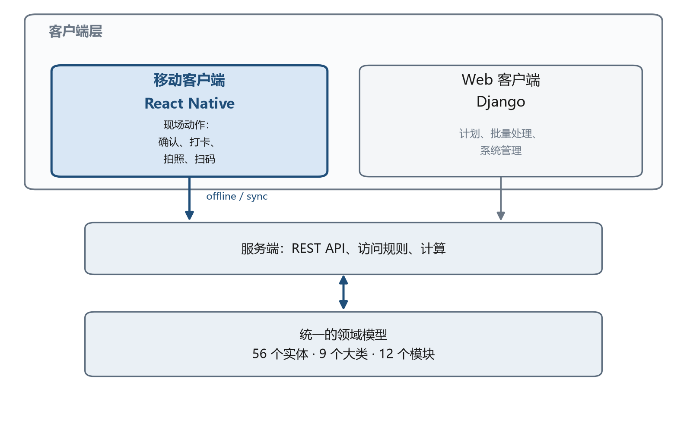
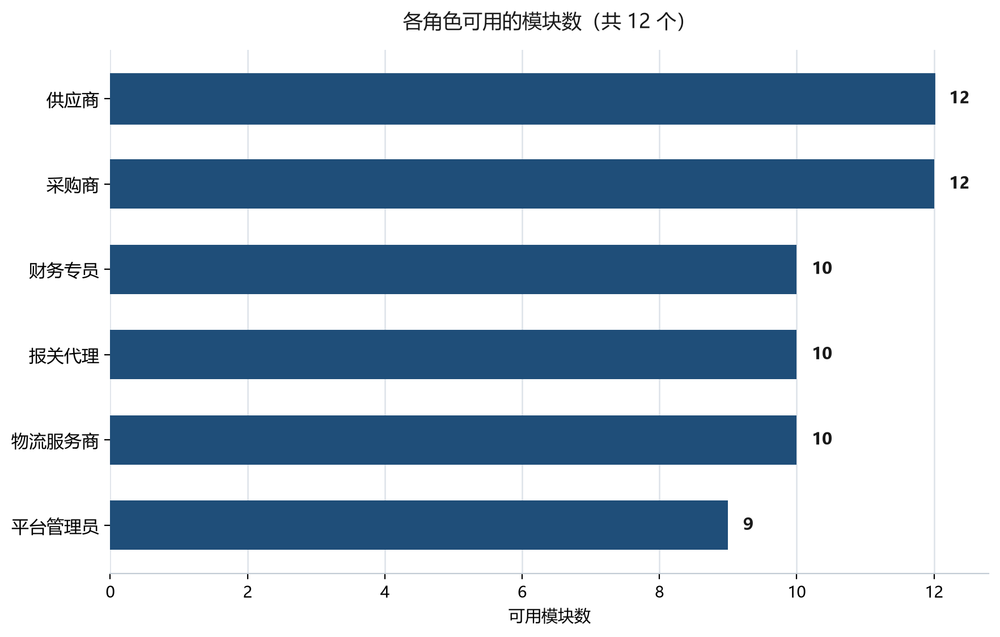
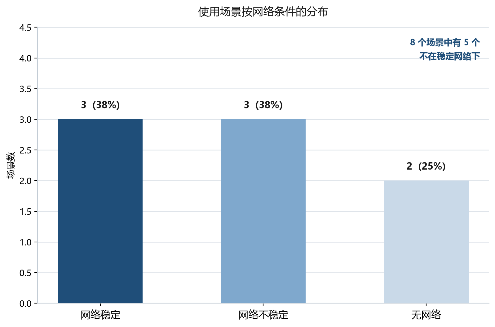
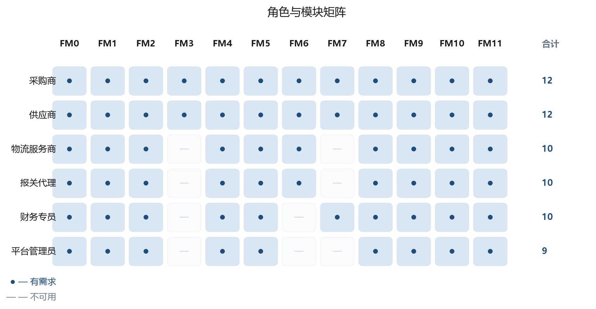
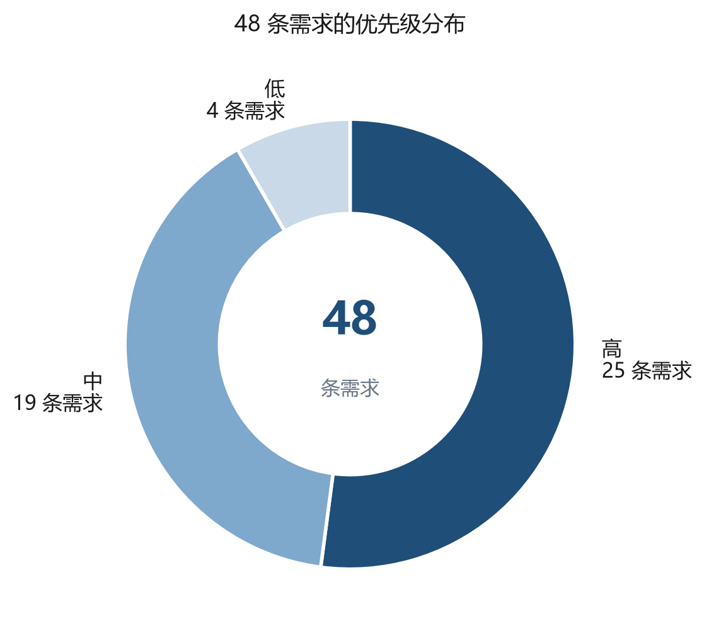

# 中俄跨境贸易轻量化协同平台「SinoRus TradeLite」移动端：学科领域与功能需求

- **课程设计:** 课　程　设　计
- **课程:** 课程：移动应用开发技术
- **阶段:** 第一阶段　学科领域描述与功能需求列表
- **完成人:** 完成人： · ПРИк-223 班学生 · 严耀
- **验收人:** 验收人： · ИСПИ 教研室助教 · Евдокимов А.О.
- **地点与年份:** 弗拉基米尔　2026 年

> 本文件由 `requirements.py` 与 `content_zh.py` 自动生成（`python mdgen.py`），请勿手工编辑。

## 摘　要

本文档含 5 幅插图、26 张表格、12 条参考文献。

本文档是《移动应用开发技术》课程设计第一阶段的交付物，完成两项任务：从移动端的角度描述项目所在的学科领域，并形成移动应用的功能需求列表。

第一章描述学科领域：说明移动端在「SinoRus TradeLite」项目中的位置、六类参与方及其诉求、八个移动使用场景、由六个阶段构成的端到端交易流程、领域边界，并给出选用 React Native 技术平台的理由以及与现有工作方式的对照。

第二章形成功能需求列表：共 48 条功能需求，分布于 12 个模块；同时给出需求总登记表、角色与模块的对应矩阵、需求的优先级分布以及 12 条非功能需求。

本阶段的产出是一份达成一致的需求列表，它是后续各阶段设计移动端数据模型、界面与导航的直接输入。

关键词：移动应用；学科领域；功能需求；非功能需求；跨境贸易；React Native；离线模式；使用场景。

## 英文摘要

This document is the result of the first stage of the course project in the discipline “Mobile Application Development Technology”. It describes the subject area of the project from the mobile point of view and forms the list of functional requirements for the mobile client of the SinoRus TradeLite platform.

Chapter 1 characterises the subject area: the place of the mobile client in the project, six groups of participants, eight mobile usage scenarios, the end-to-end deal process in six stages, the boundaries of the scope, the rationale for choosing React Native and a comparison with existing ways of working.

Chapter 2 contains 48 functional requirements grouped into 12 modules, together with a consolidated register, a role-to-module matrix, a priority breakdown and 12 non-functional requirements.

The outcome of the stage is an agreed list of requirements that serves as the input for designing the data model, screens and navigation of the mobile application.

Keywords: mobile application; subject area; functional requirements; non-functional requirements; cross-border trade; React Native; offline mode; usage scenarios

## 目　录

- [摘　要](#摘要)
- [英文摘要](#英文摘要)
- [定义、符号与缩略语](#定义符号与缩略语)
- [引　言](#引言)
- [1　学科领域描述](#1学科领域描述)
  - [1.1　学科领域总体特征](#11学科领域总体特征)
  - [1.2　移动端在项目中的位置](#12移动端在项目中的位置)
  - [1.3　参与方及其角色](#13参与方及其角色)
  - [1.4　移动使用场景](#14移动使用场景)
  - [1.5　移动端的端到端交易流程](#15移动端的端到端交易流程)
  - [1.6　学科领域边界](#16学科领域边界)
  - [1.7　技术平台](#17技术平台)
  - [1.8　与现有工作方式的对照](#18与现有工作方式的对照)
- [2　功能需求列表](#2功能需求列表)
  - [2.1　需求列表的编制原则](#21需求列表的编制原则)
  - [2.2　需求分类](#22需求分类)
  - [2.3　各模块需求](#23各模块需求)
  - [2.4　需求总登记表](#24需求总登记表)
  - [2.5　角色与模块矩阵](#25角色与模块矩阵)
  - [2.6　优先级与实现次序](#26优先级与实现次序)
  - [2.7　非功能需求](#27非功能需求)
- [结　论](#结论)
- [参考文献](#参考文献)
- [附录 A （术语表）](#附录-a-术语表)
- [附录 B （按模块的需求登记表）](#附录-b-按模块的需求登记表)

## 定义、符号与缩略语

| 缩略语 | 说明 |
|---|---|
| АПК | аппаратно-программный комплекс，软硬件综合体 |
| ГОСТ | государственный стандарт，俄罗斯国家标准 |
| ЕАЭС | 欧亚经济联盟 |
| ИС | 信息系统 |
| НФТ | 非功能需求 |
| ПЗ | 课程设计说明书（пояснительная записка） |
| ПО | 软件 |
| СУБД | 数据库管理系统 |
| ТЗ | 技术任务书 |
| ФТ | 功能需求 |
| API | 应用程序编程接口 |
| APNs | Apple 推送通知服务 |
| FCM | Firebase 云消息推送服务 |
| QR | 二维码（Quick Response） |
| RFQ | 询价单（Request for Quotation） |
| TLS | 传输层安全协议 |
| UI | 用户界面 |

## 引　言

「SinoRus TradeLite」项目是一套面向中俄跨境贸易的轻量化协同平台。此前已完成的 Web 端覆盖了完整的交易闭环：从询价一直到对账。它把 43 个页面组织成 12 个模块，并建立在 9 大类共 56 个领域实体之上。

Web 端的实践表明，相当一部分操作并不发生在办公桌前。供应商业务员在展会现场，仓库员在库房，报关代理在口岸，负责人在出差途中。这些场合没有工位，网络也往往不稳定甚至完全中断。为大屏幕和稳定连接而设计的 Web 端，在这些情况下并不好用。

本文档开启移动端开发阶段，完成两项任务：从移动端的角度描述项目所在的学科领域，并形成移动应用的功能需求列表。

为达成上述目标，需要解决以下问题：

1. 刻画学科领域，并提炼出其中的移动端特性；
2. 确定移动端在项目中的位置，以及它相对 Web 端的边界；
3. 识别参与方类别及其诉求；
4. 描述移动使用场景，以及这些场景所处的网络条件；
5. 论证技术平台的选型；
6. 形成、分类并对功能需求排定优先级；
7. 确定对应用的非功能要求。

本文档分两章。第一章描述学科领域，第二章给出功能需求列表。结论部分总结本阶段成果并确定下一阶段的任务。

## 1　学科领域描述

### 1.1　学科领域总体特征

项目的学科领域是中俄跨境贸易参与方之间的协同环节。所谓协同环节，指的是介于贸易主体与执行方（承运人、报关代理、仓库）之间的功能层，它把交易本身、随附单证与当前状态汇总到一处。

该领域中的一笔交易依次经过六个阶段：询价、报价、订单、履约、单证与运输、结算。每个阶段都会产生各自的数据与单证，而交易各方分处不同国家，使用不同语言，处在不同的法律环境之下。

以下领域特征直接决定了软件需求。

- 双语：每笔交易都伴随中俄双语的往来沟通与单证，双方都必须依赖自动翻译；
- 运输链条长：从发货到收货要经过数周，货物需通过多个口岸，交易状态在办公室人员不参与的情况下持续变化；
- 单证密集：商业发票、装箱单、合同、运单、原产地证书与合格证书——单证是否齐备直接决定能否顺利通关；
- 参与方分散：采购商、供应商、承运人与报关代理分属不同组织、不同地点；
- 出错代价高：日期写错、证书缺失或数量未谈妥，都会造成货物滞留与直接经济损失。

项目此前已开发出 Web 端平台，实现了完整的交易闭环。但 Web 端预设了工位、大屏幕与稳定网络。本文档从另一个侧面——移动端——来考察同一学科领域，确定哪些任务应当由手机完成。

### 1.2　移动端在项目中的位置

项目采用三层结构：统一的服务端、Web 客户端与移动客户端。服务端负责存储数据及其处理规则，因此两个客户端使用同一套领域模型，不会在实体理解上出现分歧。

两个客户端的职责划分依据的是操作性质，而不是可用数据的范围。

- Web 端面向计划、批量处理与管理：维护商品目录、配置字典、生成报表、编辑合同模板；
- 移动端面向「此时此刻」的动作：确认、打卡、拍照、扫码、审批、沟通；
- 两端共用数据、字典、访问权限与计算规则。

*图 1 – 移动端在项目架构中的位置*

如图 1 所示，移动端并不重复 Web 端，而是服务于一类特有的使用情境。移动端模块与 Web 端模块的对应关系见表 1。

**表 1 – 移动端模块与 Web 端模块的对应关系**

| 模块 | 移动端名称 | Web 端模块 | Web 端名称 |
|---|---|---|---|
| FM0 | 通用与导航 | M0 | Общие страницы |
| FM1 | 认证与账号 | M1 | Предприятие и аккаунт |
| FM2 | 工作台与待办 | M8 | Задачи и напоминания |
| FM3 | 询价与报价 | M3 | Запросы и предложения |
| FM4 | 订单与履约 | M4 | Заказы |
| FM5 | 单证与扫码 | M6 | Документы и соответствие |
| FM6 | 物流与跟踪 | M5 | Логистика и пункты пропуска |
| FM7 | 结算与对账 | M10 | Расчёты и сверка |
| FM8 | 消息与翻译 | M7 | Двуязычное общение |
| FM9 | 通知与推送 | M8 | Задачи и напоминания |
| FM10 | 离线与同步 | — | — |
| FM11 | 设置与管理 | M11 | Администрирование |

> **说明.** 模块 FM10「离线与同步」在 Web 端没有对应模块：无网可用与待同步队列正是移动客户端的固有属性。模块 FM2 与 FM9 依托Web 端的 M8 模块，即任务与提醒模块。

### 1.3　参与方及其角色

学科领域中共有六类参与方。用户所属的类别决定其可用模块与可见数据范围：一家企业的用户看不到与己无关的其他企业的交易。

**表 2 – 移动应用的用户角色**

| 编号 | 角色 | 说明 |
|---|---|---|
| R1 | 采购商 | 中国或俄罗斯的采购方，向对方国家的供应商采购商品。发起询价、比较报价、确认订单并验收货物。 |
| R2 | 供应商 | 卖方企业。维护商品目录、回复询价、确认订单、记录阶段完成情况并发货。 |
| R3 | 物流服务商 | 承运或货代企业。安排运输、维护运输状态并记录口岸通行情况。 |
| R4 | 报关代理 | 负责报关的专业人员。核查单证齐备性与有效期，并在查验时陪同货物。 |
| R5 | 财务专员 | 负责开票、确认款项到账与按订单对账的财务人员。 |
| R6 | 平台管理员 | 平台方人员。维护字典、管理用户与权限、查看操作日志。 |

各角色对模块的覆盖并不均衡。采购商与供应商涉及的模块最多，因为交易自始至终由他们推进；物流服务商与报关代理集中在运输与单证；财务专员围绕结算工作；平台管理员则主要负责字典与权限。角色与模块的对应关系见图 2。

*图 2 – 用户角色及其可用模块*

### 1.4　移动使用场景

移动端在操作发生在工位之外时才有价值。根据对学科领域的分析，提炼出八个典型场景，见表 3。

**表 3 – 移动使用场景**

| 编号 | 场景 | 说明 | 角色 | 网络条件 |
|---|---|---|---|---|
| SC-01 | 展会现场 | 供应商业务员在展台收到中方采购商的询价，扫描名片二维码，直接用手机就三个商品行发出报价。 | 采购商、供应商 | Неустойчивая |
| SC-02 | 仓库收货 | 仓库员收货，扫描箱体条码并完成阶段打卡；仓库地下无信号，操作进入队列。 | 供应商、物流服务商 | Отсутствует |
| SC-03 | 口岸查验 | 报关代理在查验时用手机打开单证包，核对证书有效期。 | 报关代理 | Неустойчивая |
| SC-04 | 供应商出差 | 出差员工在应用会话中协商条件变更，消息自动翻译成中文。 | 供应商 | Есть |
| SC-05 | 外出签单 | 负责人在对方公司现场拍摄已签合同并上传到订单详情。 | 采购商、供应商 | Есть |
| SC-06 | 通勤中审批 | 员工在地铁里用已缓存数据确认报价并指派阶段，全程无网。 | 采购商 | Отсутствует |
| SC-07 | 车间确认 | 车间主管核实成品实际数量并确认发货批次，无需离开车间。 | 供应商 | Неустойчивая |
| SC-08 | 异常应急 | 货物受损时物流人员拍照登记异常；通知同时送达采购商与报关代理。 | 采购商、物流服务商、报关代理 | Есть |

相当一部分场景发生在网络不稳定或完全没有网络的环境中：库房、地下室、口岸之间的路段。这一点正是移动端区别于 Web 端的主要所在，也决定了离线能力方面的需求。场景按网络条件的分布见图 3。

*图 3 – 使用场景按网络条件的分布*

> **说明.** 八个场景中只有三个处于稳定联网状态。其余五个要么要求完全离线工作，要么要求能容忍网络中断。这使得离线能力成为应用的必备属性，而不是附加功能。

### 1.5　移动端的端到端交易流程

交易的六个阶段在移动端都有呈现，但完整程度不同。涉及决策与事实记录的阶段被完整实现；需要批量处理数据的阶段只实现控制所必需的部分。阶段与操作的对应关系见表 4。

**表 4 – 交易阶段与移动端操作**

| 阶段 | 名称 | 内容 | 移动端操作 |
|---|---|---|---|
| 1 | 询价 | 提出需求并向供应商发出询价 | 从商品目录发起询价、拍摄样品照片 |
| 2 | 报价 | 供应商给出价格、交期与贸易条件 | 查看并比较报价、确认选中的报价 |
| 3 | 订单 | 锁定协商结果并生成订单 | 核对订单详情、确认履约阶段 |
| 4 | 履约 | 生产或备货，分批发运 | 阶段打卡、确认发货、登记异常 |
| 5 | 单证与运输 | 办理单证、接受查验并运输至目的地 | 扫码、拍照上传单证、齐备性检查、运输跟踪 |
| 6 | 结算 | 开票、款项到账与对账 | 查看账单、确认到账、按订单对账 |

### 1.6　学科领域边界

为了让移动应用保持快速与可预期，一部分操作被有意移出它的边界，交由 Web 端承担。这些操作及其原因见表 5。

**表 5 – 移出移动端边界的操作**

| 操作 | 移出移动端的原因 |
|---|---|
| 批量导入与导出数据 | 需要解析大文件且耗时较长；在 Web 端完成。 |
| 复杂分析报表 | 多维度取数与导出在小屏幕上不便操作。 |
| 编辑合同模板 | 打印表单需要完整编辑器并校验版式。 |
| 配置集成与 API | 属于一次性操作且需接触密钥；保留在 Web 端。 |
| 单证批量处理 | 批量操作在桌面端更顺手。 |

> **说明.** 把操作移出移动端并不意味着数据丢失：在 Web 端完成的结果会在下一次同步后以只读方式出现在移动应用中。

### 1.7　技术平台

技术平台选用跨平台框架 React Native，理由如下：

- 在课程设计有限的时间内，用一套代码同时产出 Android 与 iOS 应用；
- 生态成熟，相机、推送通知与本地存储都有现成模块；
- 可以复用项目中 Web 部分已经用到的 JavaScript 语言与开发思路；
- 具备界面单元测试与端到端测试的工具链。

技术栈构成见表 6。

**表 6 – 移动应用技术栈**

| 组件 | 用途 |
|---|---|
| React Native | 跨平台框架：一套代码同时产出 Android 与 iOS 应用。 |
| TypeScript | 静态类型与自动补全，降低开发期错误。 |
| React Navigation | 底部导航、页面栈与深链跳转。 |
| Redux Toolkit и RTK Query | 统一应用状态，并缓存服务端数据、复用重复请求。 |
| SQLite (op-sqlite) | 离线模式与待同步操作队列的本地存储。 |
| Vision Camera | 条码与二维码扫描、单证拍摄与画面处理。 |
| Firebase Cloud Messaging и APNs | 向 Android 与 iOS 投递推送通知。 |
| i18next | 界面俄语、中文、英语三语本地化。 |
| Keychain и Keystore | 在设备上安全存放访问令牌。 |
| Jest и Detox | 逻辑单元测试与界面端到端测试。 |

### 1.8　与现有工作方式的对照

在移动客户端出现之前，参与方用手边现成的工具处理移动场景下的任务。这些方式各有明显缺陷。

- 电话与第三方即时通讯：沟通很快，但约定不绑定到交易，不进入订单历史，出现分歧时无法作为凭据；
- 电子邮件：往来记录得以保存，但附件与回复在时间上脱节，按订单号检索邮件十分困难；
- 在手机浏览器中打开 Web 端：界面按大屏幕设计，用屏幕键盘录入吃力，断网时完全无法工作；
- 现成的管理软件移动客户端：需要部署与配置，不支持交易内部的双语沟通，也难以适配跨境单证的特殊要求。

本项目的移动应用消除了上述缺陷：沟通在交易内部进行并随交易一并留存，自动翻译消除了语言障碍，离线能力使得在没有信号的地方也能记录事实。同时，它并不取代 Web 端，而是与之互补。

## 2　功能需求列表

### 2.1　需求列表的编制原则

功能需求列表依据学科领域描述与使用场景形成，编制时遵循以下原则。

1. 每条需求都有唯一编号，且只归属一个模块；
2. 需求描述的是系统可被观察到的行为，而不是实现方式；
3. 每条需求都标明关注它的角色与优先级；
4. 需求可验证：无需查阅源代码即可判定其是否实现；
5. 列表不重复 Web 端已有需求，而是以移动端特性加以补充。

### 2.2　需求分类

共形成 48 条功能需求，分布于 12 个模块。模块把面向同一工作领域的需求归集在一起，对应底部导航中的一个分区或一个独立页面。需求按模块与优先级的分布见表 7。

**表 7 – 功能需求按模块的分类**

| 模块 | 名称 | 数量 | 高 | 中 | 低 | Web 端模块 |
|---|---|---|---|---|---|---|
| FM0 | 通用与导航 | 3 | 2 | 1 | 0 | Общие страницы |
| FM1 | 认证与账号 | 4 | 2 | 2 | 0 | Предприятие и аккаунт |
| FM2 | 工作台与待办 | 4 | 2 | 2 | 0 | Задачи и напоминания |
| FM3 | 询价与报价 | 4 | 3 | 1 | 0 | Запросы и предложения |
| FM4 | 订单与履约 | 5 | 3 | 2 | 0 | Заказы |
| FM5 | 单证与扫码 | 5 | 3 | 2 | 0 | Документы и соответствие |
| FM6 | 物流与跟踪 | 4 | 1 | 1 | 2 | Логистика и пункты пропуска |
| FM7 | 结算与对账 | 4 | 1 | 2 | 1 | Расчёты и сверка |
| FM8 | 消息与翻译 | 4 | 3 | 0 | 1 | Двуязычное общение |
| FM9 | 通知与推送 | 3 | 1 | 2 | 0 | Задачи и напоминания |
| FM10 | 离线与同步 | 4 | 3 | 1 | 0 | — |
| FM11 | 设置与管理 | 4 | 1 | 3 | 0 | Администрирование |
| 合计 |  | 48 | 25 | 19 | 4 |  |

需求最多的是 FM4「订单与履约」与 FM5「单证与扫码」两个模块，各五条。这反映出移动端的使用特征：记录履约事实与处理单证，恰恰都发生在工位之外。FM9「通知与推送」只有三条需求，因为其中一部分功能由操作系统自身提供。

### 2.3　各模块需求

以下按模块列出需求。表中给出需求编号、名称、内容、关注该需求的角色以及优先级。

#### 2.3.1 FM0 模块需求：通用与导航

FM0 模块「通用与导航」共 3 条需求。每次启动都会看到的界面：启动页、底部导航与全局搜索。它们构成其余模块赖以运行的骨架。

**表 8 – FM0 模块「通用与导航」需求**

| 编号 | 需求名称 | 需求内容 | 角色 | 优先级 |
|---|---|---|---|---|
| FR-001 | 启动与首次加载 | 应用启动后检查版本、恢复已保存的会话，并显示首页或登录页。 | 采购商、供应商、物流服务商、报关代理、财务专员、平台管理员 | 高 |
| FR-002 | 底部标签导航 | 常驻底部面板，含四个主分区（工作台、订单、消息、我的）；当前分区高亮，退出后仍保留上次位置。 | 采购商、供应商、物流服务商、报关代理、财务专员、平台管理员 | 高 |
| FR-003 | 全局搜索 | 在统一搜索框中检索订单号、询价号、往来单位与商品；结果按对象类型分组。 | 采购商、供应商、物流服务商、报关代理、财务专员、平台管理员 | 中 |

#### 2.3.2 FM1 模块需求：认证与账号

FM1 模块「认证与账号」共 4 条需求。登录应用、生物识别快速进入、查看与修改个人资料，以及在用户所属的多个企业之间切换。

**表 9 – FM1 模块「认证与账号」需求**

| 编号 | 需求名称 | 需求内容 | 角色 | 优先级 |
|---|---|---|---|---|
| FR-004 | 账号密码登录 | 使用账号密码登录，并限制尝试次数；成功后发放有期限的访问令牌。 | 采购商、供应商、物流服务商、报关代理、财务专员、平台管理员 | 高 |
| FR-005 | 生物识别快速登录 | 再次进入时用指纹或面容识别免密登录；仅在首次密码登录成功后才可启用。 | 采购商、供应商、物流服务商、报关代理、财务专员、平台管理员 | 中 |
| FR-006 | 查看与编辑个人资料 | 查看姓名、职务、联系方式与头像；可修改联系信息并上传照片。 | 采购商、供应商、物流服务商、报关代理、财务专员、平台管理员 | 中 |
| FR-007 | 切换所属企业 | 在用户所属的多个企业之间切换；切换后可见数据与权限随之更新。 | 采购商、供应商、物流服务商、报关代理、财务专员、平台管理员 | 高 |

#### 2.3.3 FM2 模块需求：工作台与待办

FM2 模块「工作台与待办」共 4 条需求。关键指标概览、今日待办清单、快捷操作与业务动态时间线。日常工作的入口。

**表 10 – FM2 模块「工作台与待办」需求**

| 编号 | 需求名称 | 需求内容 | 角色 | 优先级 |
|---|---|---|---|---|
| FR-008 | 关键指标概览 | 以卡片展示进行中订单数、待付金额、最近期限与逾期任务数；返回该页时自动刷新。 | 采购商、供应商、财务专员 | 高 |
| FR-009 | 今日待办列表 | 按期限排序的待办清单：确认报价、阶段打卡、上传单证、确认付款。 | 采购商、供应商、物流服务商、报关代理、财务专员、平台管理员 | 高 |
| FR-010 | 快捷操作入口 | 常用操作的快捷入口磁贴：扫码、发起询价、上传单证、联系对方。 | 采购商、供应商、物流服务商、报关代理 | 中 |
| FR-011 | 业务动态时间线 | 按时间倒序展示用户相关订单的变更，标注操作人与时间。 | 采购商、供应商、物流服务商、报关代理、财务专员、平台管理员 | 中 |

#### 2.3.4 FM3 模块需求：询价与报价

FM3 模块「询价与报价」共 4 条需求。处理询价与报价：查看列表、直接用手机发起询价、比价并确认选中的报价。

**表 11 – FM3 模块「询价与报价」需求**

| 编号 | 需求名称 | 需求内容 | 角色 | 优先级 |
|---|---|---|---|---|
| FR-012 | 询价单列表 | 询价单列表，可按状态、往来单位与日期筛选；显示商品行数与回复期限。 | 采购商、供应商 | 高 |
| FR-013 | 手机端发起询价 | 基于模板发起询价：从商品目录选择商品、填写数量与回复期限并发送给对方。 | 采购商 | 高 |
| FR-014 | 报价查看与比价 | 查看收到的报价，并在同一张表中按价格、交期与贸易条件比价。 | 采购商 | 高 |
| FR-015 | 接受报价 | 确认选中的报价并锁定该版本；确认后自动生成订单。 | 采购商 | 中 |

#### 2.3.5 FM4 模块需求：订单与履约

FM4 模块「订单与履约」共 5 条需求。带筛选的订单列表、订单详情、履约阶段打卡、确认发货批次与异常上报。

**表 12 – FM4 模块「订单与履约」需求**

| 编号 | 需求名称 | 需求内容 | 角色 | 优先级 |
|---|---|---|---|---|
| FR-016 | 订单列表与筛选 | 订单列表，可按角色、状态、往来单位与时间段筛选；支持按单号搜索。 | 采购商、供应商、物流服务商、报关代理、财务专员、平台管理员 | 高 |
| FR-017 | 订单详情 | 订单完整信息：商品行、金额、阶段、批次、单证与关联消息，以标签页集中在一个页面。 | 采购商、供应商、物流服务商、报关代理、财务专员、平台管理员 | 高 |
| FR-018 | 履约阶段打卡 | 记录阶段实际完成情况，含日期、备注与照片凭证；该阶段转为「已完成」。 | 供应商、物流服务商 | 高 |
| FR-019 | 确认发货批次 | 从订单商品行中组批，填写数量与发货日期，并关联运输单证。 | 供应商、物流服务商 | 中 |
| FR-020 | 异常上报 | 登记订单异常：类型、描述、照片与受影响商品行；异常进入责任人的待办清单。 | 采购商、供应商、物流服务商、报关代理 | 中 |

#### 2.3.6 FM5 模块需求：单证与扫码

FM5 模块「单证与扫码」共 5 条需求。条码与二维码扫描、拍照上传单证、齐备性检查、到期提醒，以及离线查看已缓存的单证。

**表 13 – FM5 模块「单证与扫码」需求**

| 编号 | 需求名称 | 需求内容 | 角色 | 优先级 |
|---|---|---|---|---|
| FR-021 | 条码与二维码扫描 | 用相机扫描商品条码与单证二维码；识别后直接打开关联对象。 | 供应商、物流服务商、报关代理 | 高 |
| FR-022 | 拍照上传单证 | 拍照采集单证，自动裁边并增强对比度，选择单证类型后上传服务器。 | 采购商、供应商、物流服务商、报关代理 | 高 |
| FR-023 | 单证齐备性检查 | 按订单或批次检查单证是否齐备，缺失项高亮提示。 | 报关代理 | 高 |
| FR-024 | 有效期到期提醒 | 对三十天内即将到期的单证与证书发出提醒。 | 采购商、供应商、报关代理 | 中 |
| FR-025 | 离线查看单证 | 无网络时查看此前已加载的单证；文件保存在设备本地缓存中。 | 采购商、供应商、物流服务商、报关代理、财务专员、平台管理员 | 中 |

#### 2.3.7 FM6 模块需求：物流与跟踪

FM6 模块「物流与跟踪」共 4 条需求。运输状态跟踪、含口岸的路线地图、运费试算，以及与司机联系。

**表 14 – FM6 模块「物流与跟踪」需求**

| 编号 | 需求名称 | 需求内容 | 角色 | 优先级 |
|---|---|---|---|---|
| FR-026 | 运输状态跟踪 | 每个批次的当前运输状态、状态流转历史与预计到达时间。 | 采购商、供应商、物流服务商 | 高 |
| FR-027 | 路线与口岸地图 | 在地图上显示路线与已通过的口岸，并可点击查看口岸信息。 | 采购商、物流服务商、报关代理 | 中 |
| FR-028 | 运费试算 | 在下单前按重量、体积与线路试算运费。 | 采购商、供应商 | 低 |
| FR-029 | 联系司机 | 通过运输详情中的号码给司机打电话或发消息。 | 采购商、物流服务商 | 低 |

#### 2.3.8 FM7 模块需求：结算与对账

FM7 模块「结算与对账」共 4 条需求。查看账单与付款、确认款项到账、按订单对账，以及导出账单 PDF。

**表 15 – FM7 模块「结算与对账」需求**

| 编号 | 需求名称 | 需求内容 | 角色 | 优先级 |
|---|---|---|---|---|
| FR-030 | 账单与付款查看 | 账单列表，含金额、期限与付款状态；可跳转到关联订单。 | 采购商、供应商、财务专员 | 高 |
| FR-031 | 到账确认 | 登记款项到账，填写日期、金额与付款凭证号。 | 财务专员 | 中 |
| FR-032 | 按订单对账 | 比对订单的应收与实收，输出差额与期末余额。 | 采购商、财务专员 | 中 |
| FR-033 | 导出账单 PDF | 生成并导出账单或对账单 PDF，用于发给对方。 | 财务专员 | 低 |

#### 2.3.9 FM8 模块需求：消息与翻译

FM8 模块「消息与翻译」共 4 条需求。与具体业务绑定的会话、发送文字/图片/文件、消息自动翻译，以及常用语模板。

**表 16 – FM8 模块「消息与翻译」需求**

| 编号 | 需求名称 | 需求内容 | 角色 | 优先级 |
|---|---|---|---|---|
| FR-034 | 与业务绑定的会话 | 会话在具体订单或询价的上下文中进行；可从会话跳转到业务对象本身。 | 采购商、供应商、物流服务商、报关代理、财务专员、平台管理员 | 高 |
| FR-035 | 发送文字、图片与文件 | 发送文字、图片与文件；支持在会话中直接拍照。 | 采购商、供应商、物流服务商、报关代理、财务专员、平台管理员 | 高 |
| FR-036 | 消息自动翻译 | 在俄语与中文之间自动翻译收发消息，并可切换查看原文。 | 采购商、供应商、物流服务商、报关代理、财务专员、平台管理员 | 高 |
| FR-037 | 常用语模板 | 面向典型场景的固定话术：询问交期、索要单证、催款提醒。 | 采购商、供应商 | 低 |

#### 2.3.10 FM9 模块需求：通知与推送

FM9 模块「通知与推送」共 3 条需求。业务事件的推送通知、通知分类设置，以及应用内通知中心。

**表 17 – FM9 模块「通知与推送」需求**

| 编号 | 需求名称 | 需求内容 | 角色 | 优先级 |
|---|---|---|---|---|
| FR-038 | 业务事件推送 | 就新报价、订单状态变更、单证到期与款项到账推送通知。 | 采购商、供应商、物流服务商、报关代理、财务专员、平台管理员 | 高 |
| FR-039 | 通知分类设置 | 按类别开关通知，并设置免打扰时段。 | 采购商、供应商、物流服务商、报关代理、财务专员、平台管理员 | 中 |
| FR-040 | 应用内通知中心 | 应用内全部通知的历史记录，可跳转到关联对象。 | 采购商、供应商、物流服务商、报关代理、财务专员、平台管理员 | 中 |

#### 2.3.11 FM10 模块需求：离线与同步

FM10 模块「离线与同步」共 4 条需求。无网可用、待同步操作队列、恢复网络后自动同步，以及版本冲突处理。这是 Web 端没有的模块。

**表 18 – FM10 模块「离线与同步」需求**

| 编号 | 需求名称 | 需求内容 | 角色 | 优先级 |
|---|---|---|---|---|
| FR-041 | 无网可用 | 待办、订单与单证等主要页面在无网络时仍可打开阅读。 | 采购商、供应商、物流服务商、报关代理、财务专员、平台管理员 | 高 |
| FR-042 | 待同步操作队列 | 无网时的操作进入队列，网络恢复后自动提交服务器。 | 采购商、供应商、物流服务商、报关代理、财务专员、平台管理员 | 高 |
| FR-043 | 自动同步 | 后台同步变更，显示上次成功同步时间并支持手动触发。 | 采购商、供应商、物流服务商、报关代理、财务专员、平台管理员 | 高 |
| FR-044 | 冲突处理 | 当本地版本与服务器版本不一致时，向用户提示差异并让其选择保留哪一版。 | 采购商、供应商、物流服务商、报关代理、财务专员、平台管理员 | 中 |

#### 2.3.12 FM11 模块需求：设置与管理

FM11 模块「设置与管理」共 4 条需求。界面语言切换、字典维护、用户操作日志，以及用户与权限管理。

**表 19 – FM11 模块「设置与管理」需求**

| 编号 | 需求名称 | 需求内容 | 角色 | 优先级 |
|---|---|---|---|---|
| FR-045 | 界面语言切换 | 在俄语、中文与英语之间切换界面语言，无需重启应用。 | 采购商、供应商、物流服务商、报关代理、财务专员、平台管理员 | 高 |
| FR-046 | 字典维护 | 查看与维护字典：单证类型、计量单位、贸易条件。 | 平台管理员 | 中 |
| FR-047 | 操作日志 | 查看用户关键操作日志，可按日期、用户与操作类型筛选。 | 平台管理员 | 中 |
| FR-048 | 用户与权限管理 | 新增用户、分配角色与停用账号。 | 平台管理员 | 中 |

### 2.4　需求总登记表

总登记表把 48 条需求汇总为按编号排列的单一清单，见表 20。

**表 20 – 功能需求总登记表**

| 编号 | 模块 | 需求名称 | 角色 | 优先级 |
|---|---|---|---|---|
| FR-001 | FM0 | 启动与首次加载 | R1, R2, R3, R4, R5, R6 | 高 |
| FR-002 | FM0 | 底部标签导航 | R1, R2, R3, R4, R5, R6 | 高 |
| FR-003 | FM0 | 全局搜索 | R1, R2, R3, R4, R5, R6 | 中 |
| FR-004 | FM1 | 账号密码登录 | R1, R2, R3, R4, R5, R6 | 高 |
| FR-005 | FM1 | 生物识别快速登录 | R1, R2, R3, R4, R5, R6 | 中 |
| FR-006 | FM1 | 查看与编辑个人资料 | R1, R2, R3, R4, R5, R6 | 中 |
| FR-007 | FM1 | 切换所属企业 | R1, R2, R3, R4, R5, R6 | 高 |
| FR-008 | FM2 | 关键指标概览 | R1, R2, R5 | 高 |
| FR-009 | FM2 | 今日待办列表 | R1, R2, R3, R4, R5, R6 | 高 |
| FR-010 | FM2 | 快捷操作入口 | R1, R2, R3, R4 | 中 |
| FR-011 | FM2 | 业务动态时间线 | R1, R2, R3, R4, R5, R6 | 中 |
| FR-012 | FM3 | 询价单列表 | R1, R2 | 高 |
| FR-013 | FM3 | 手机端发起询价 | R1 | 高 |
| FR-014 | FM3 | 报价查看与比价 | R1 | 高 |
| FR-015 | FM3 | 接受报价 | R1 | 中 |
| FR-016 | FM4 | 订单列表与筛选 | R1, R2, R3, R4, R5, R6 | 高 |
| FR-017 | FM4 | 订单详情 | R1, R2, R3, R4, R5, R6 | 高 |
| FR-018 | FM4 | 履约阶段打卡 | R2, R3 | 高 |
| FR-019 | FM4 | 确认发货批次 | R2, R3 | 中 |
| FR-020 | FM4 | 异常上报 | R1, R2, R3, R4 | 中 |
| FR-021 | FM5 | 条码与二维码扫描 | R2, R3, R4 | 高 |
| FR-022 | FM5 | 拍照上传单证 | R1, R2, R3, R4 | 高 |
| FR-023 | FM5 | 单证齐备性检查 | R4 | 高 |
| FR-024 | FM5 | 有效期到期提醒 | R1, R2, R4 | 中 |
| FR-025 | FM5 | 离线查看单证 | R1, R2, R3, R4, R5, R6 | 中 |
| FR-026 | FM6 | 运输状态跟踪 | R1, R2, R3 | 高 |
| FR-027 | FM6 | 路线与口岸地图 | R1, R3, R4 | 中 |
| FR-028 | FM6 | 运费试算 | R1, R2 | 低 |
| FR-029 | FM6 | 联系司机 | R1, R3 | 低 |
| FR-030 | FM7 | 账单与付款查看 | R1, R2, R5 | 高 |
| FR-031 | FM7 | 到账确认 | R5 | 中 |
| FR-032 | FM7 | 按订单对账 | R1, R5 | 中 |
| FR-033 | FM7 | 导出账单 PDF | R5 | 低 |
| FR-034 | FM8 | 与业务绑定的会话 | R1, R2, R3, R4, R5, R6 | 高 |
| FR-035 | FM8 | 发送文字、图片与文件 | R1, R2, R3, R4, R5, R6 | 高 |
| FR-036 | FM8 | 消息自动翻译 | R1, R2, R3, R4, R5, R6 | 高 |
| FR-037 | FM8 | 常用语模板 | R1, R2 | 低 |
| FR-038 | FM9 | 业务事件推送 | R1, R2, R3, R4, R5, R6 | 高 |
| FR-039 | FM9 | 通知分类设置 | R1, R2, R3, R4, R5, R6 | 中 |
| FR-040 | FM9 | 应用内通知中心 | R1, R2, R3, R4, R5, R6 | 中 |
| FR-041 | FM10 | 无网可用 | R1, R2, R3, R4, R5, R6 | 高 |
| FR-042 | FM10 | 待同步操作队列 | R1, R2, R3, R4, R5, R6 | 高 |
| FR-043 | FM10 | 自动同步 | R1, R2, R3, R4, R5, R6 | 高 |
| FR-044 | FM10 | 冲突处理 | R1, R2, R3, R4, R5, R6 | 中 |
| FR-045 | FM11 | 界面语言切换 | R1, R2, R3, R4, R5, R6 | 高 |
| FR-046 | FM11 | 字典维护 | R6 | 中 |
| FR-047 | FM11 | 操作日志 | R6 | 中 |
| FR-048 | FM11 | 用户与权限管理 | R6 | 中 |

### 2.5　角色与模块矩阵

矩阵显示各模块的需求分别涉及哪些角色。「●」表示该模块中存在与某一角色相关的需求，「—」表示该角色无法使用该模块。矩阵见表 21。

**表 21 – 角色与模块矩阵**

| 角色 | FM0 | FM1 | FM2 | FM3 | FM4 | FM5 | FM6 | FM7 | FM8 | FM9 | FM10 | FM11 | 合计 |
|---|---|---|---|---|---|---|---|---|---|---|---|---|---|
| R1 采购商 | ● | ● | ● | ● | ● | ● | ● | ● | ● | ● | ● | ● | 12 |
| R2 供应商 | ● | ● | ● | ● | ● | ● | ● | ● | ● | ● | ● | ● | 12 |
| R3 物流服务商 | ● | ● | ● | — | ● | ● | ● | — | ● | ● | ● | ● | 10 |
| R4 报关代理 | ● | ● | ● | — | ● | ● | ● | — | ● | ● | ● | ● | 10 |
| R5 财务专员 | ● | ● | ● | — | ● | ● | — | ● | ● | ● | ● | ● | 10 |
| R6 平台管理员 | ● | ● | ● | — | ● | ● | — | — | ● | ● | ● | ● | 9 |
| 合计 | 3 | 4 | 4 | 4 | 5 | 5 | 4 | 4 | 4 | 3 | 4 | 4 | 48 |

矩阵表明，采购商与供应商可用的模块最多，因为交易从询价到结算都由他们推进。物流服务商与报关代理集中在运输与单证模块，平台管理员则主要使用设置模块。分布情况见图 4。

*图 4 – 角色与模块矩阵*

### 2.6　优先级与实现次序

每条需求都被赋予优先级，用以确定实现次序。高优先级意味着缺少该需求应用就无法完成基本用途；中优先级意味着它能提升易用性与流程覆盖的完整度；低优先级意味着有价值但不影响主流程。需求按优先级的分布见表 22。

**表 22 – 需求按优先级的分布**

| 优先级 | 数量 | 占比 % | 实现次序 |
|---|---|---|---|
| 高 | 25 | 52.1 | 第一批实现：缺少这些需求，应用无法完成基本用途。 |
| 中 | 19 | 39.6 | 第二批实现：提升易用性与流程覆盖完整度。 |
| 低 | 4 | 8.3 | 有余力时实现：有价值，但不影响主流程。 |
| 合计 | 48 | 100.0 |  |

优先级构成见图 5。

*图 5 – 需求按优先级的分布*

### 2.7　非功能需求

除功能需求外，应用还需满足决定其运行质量的非功能要求，涵盖性能、兼容性、安全性、离线能力、多语言与无障碍。非功能需求见表 23。

**表 23 – 非功能需求**

| 编号 | 需求 | 验收标准 | 优先级 |
|---|---|---|---|
| NFR-01 | 冷启动 | 有网络时在中端设备上不超过 3 秒。 | 高 |
| NFR-02 | 界面响应 | 触控响应不超过 100 毫秒；列表滚动无可感知掉帧。 | 高 |
| NFR-03 | 安装包体积 | 安装包不超过 80 MB。 | 中 |
| NFR-04 | 支持平台 | Android 9 及以上、iOS 14 及以上。 | 高 |
| NFR-05 | 屏幕适配 | 在 4.7 至 7 英寸手机与平板上正确显示，支持横竖屏。 | 中 |
| NFR-06 | 通道与令牌安全 | 仅通过 TLS 1.3 通信；访问令牌存放于 iOS Keychain / Android Keystore，不写入日志。 | 高 |
| NFR-07 | 离线能力 | 至少五个关键页面在无网络时可用。 | 高 |
| NFR-08 | 缓存上限 | 本地缓存不超过 300 MB，并自动清理旧文件。 | 中 |
| NFR-09 | 多语言 | 完整支持俄、中、英三种语言，含日期与数字格式。 | 高 |
| NFR-10 | 无障碍 | 支持系统字体缩放，对比度不低于 4.5:1，控件带无障碍标签。 | 中 |
| NFR-11 | 电量消耗 | 后台同步的耗电不超过每日 3%。 | 低 |
| NFR-12 | 日志与埋点 | 本地错误日志与关键路径匿名埋点，用户可关闭。 | 低 |

在非功能需求中，离线能力与安全性尤为关键。离线能力依靠本地存储与待同步操作队列实现；安全性则依靠强制加密通道与令牌在设备上的安全存放来保证。

## 结　论

在第一阶段的课程设计中，两项任务均已完成：从移动端角度描述了项目的学科领域，并形成了移动应用的功能需求列表。

领域描述的结论如下。学科领域是中俄跨境贸易参与方之间的协同环节，包含六个交易阶段。移动客户端并不重复 Web 端，而是服务于一类特有的情境——在工位之外完成的操作。文档识别出六类参与方与八个移动使用场景，其中五个场景处于网络不稳定或完全无网的状态。另有五项需要批量处理数据的操作被有意移出应用边界。

需求方面，共形成 48 条功能需求并分布于 12 个模块：其中 25 条为高优先级，19 条为中优先级，4 条为低优先级。文档给出了角色与模块矩阵，说明六个角色各自可用的模块。此外还确定了 12 条非功能需求，涵盖性能、兼容性、安全性、离线能力、多语言与无障碍。

在后续阶段中，这份需求列表将作为直接输入，用于设计移动端的数据模型、设计界面与导航，以及制定用户操作流程与权限划分规则。

## 参考文献

1. React Native Documentation[EB/OL]. Meta Platforms, 2026. https://reactnative.dev/docs/getting-started.
2. React Navigation Documentation[EB/OL]. 2026. https://reactnavigation.org/docs/getting-started.
3. Redux Toolkit Documentation: RTK Query[EB/OL]. 2026. https://redux-toolkit.js.org/rtk-query/overview.
4. Django Software Foundation. Django Documentation: Models[EB/OL]. 2026. https://docs.djangoproject.com/en/4.2/topics/db/models/.
5. ГОСТ 7.32–2017. Система стандартов по информации, библиотечному и издательскому делу. Отчёт о научно-исследовательской работе. Структура и правила оформления[S]. Москва: Стандартинформ, 2017.
6. ГОСТ 19.701–90. Единая система программной документации. Схемы алгоритмов, программ, данных и систем. Обозначения условные и правила выполнения[S]. Москва: Издательство стандартов, 1990.
7. ГОСТ 34.602–2020. Информационные технологии. Комплекс стандартов на автоматизированные системы. Техническое задание на создание автоматизированной системы[S]. Москва: Стандартинформ, 2020.
8. Макаров Р. И., Хорошева Е. Р. Анализ и синтез информационных систем: учеб. пособие. — Владимир: Изд-во ВлГУ, 2019. — 251 с.
9. Нильсен Я. Мобильная юзабилити: как сделать сайты и приложения удобными для мобильных устройств. — Москва: Эксмо, 2020. — 288 с.
10. Федеральная таможенная служба Российской Федерации. Статистика внешней торговли за 2025 год[R]. Москва: ФТС России, 2026.
11. International Chamber of Commerce. Incoterms 2020: ICC rules for the use of domestic and international trade terms[S]. Paris: ICC, 2019.
12. World Wide Web Consortium. Web Content Accessibility Guidelines (WCAG) 2.2[S/OL]. 2023. https://www.w3.org/TR/WCAG22/.

## 附录 A （术语表）

**表 A.1 – 术语表**

| 术语 | 说明 |
|---|---|
| 学科领域 | 项目所服务的业务领域；本文档从移动端角度对其进行考察 |
| 移动端情境 | 用户在工位之外借助移动应用完成的任务集合 |
| 功能需求 | 对系统应当做什么的描述，以可被观察到的行为表述 |
| 非功能需求 | 对系统应当如何运行的描述：性能、安全、兼容性等质量特性 |
| 模块 | 面向同一工作领域的一组需求；在移动端对应底部导航的一个分区 |
| 角色 | 可用模块与权限相同的一类用户 |
| 使用场景 | 用户的一系列操作，最终产生对其有意义的结果 |
| 离线模式 | 应用在无网络连接时仍可打开并阅读数据的能力 |
| 待同步操作队列 | 保存无网时执行的操作并在之后提交服务器的机制 |
| 同步 | 本地数据与服务器数据达成一致的过程 |
| 版本冲突 | 同一对象的本地版本与服务器版本不一致的情形 |
| 推送通知 | 由操作系统投递给应用、无需用户先启动应用的消息 |
| 批次 | 一次实际发运所包含的商品集合 |
| 口岸 | 货物跨越国境所经过的边境通道 |
| 单证齐备性 | 订单或批次所需单证的完整程度 |
| 生物识别登录 | 借助设备能力用指纹或面容识别完成认证 |
| 跨平台应用 | 由一套代码为多个移动操作系统构建的应用 |

## 附录 B （按模块的需求登记表）

**表 B.1 – 按模块的需求登记表**

| 模块 | 名称 | 数量 | 需求编号 |
|---|---|---|---|
| FM0 | 通用与导航 | 3 | FR-001, FR-002, FR-003 |
| FM1 | 认证与账号 | 4 | FR-004, FR-005, FR-006, FR-007 |
| FM2 | 工作台与待办 | 4 | FR-008, FR-009, FR-010, FR-011 |
| FM3 | 询价与报价 | 4 | FR-012, FR-013, FR-014, FR-015 |
| FM4 | 订单与履约 | 5 | FR-016, FR-017, FR-018, FR-019, FR-020 |
| FM5 | 单证与扫码 | 5 | FR-021, FR-022, FR-023, FR-024, FR-025 |
| FM6 | 物流与跟踪 | 4 | FR-026, FR-027, FR-028, FR-029 |
| FM7 | 结算与对账 | 4 | FR-030, FR-031, FR-032, FR-033 |
| FM8 | 消息与翻译 | 4 | FR-034, FR-035, FR-036, FR-037 |
| FM9 | 通知与推送 | 3 | FR-038, FR-039, FR-040 |
| FM10 | 离线与同步 | 4 | FR-041, FR-042, FR-043, FR-044 |
| FM11 | 设置与管理 | 4 | FR-045, FR-046, FR-047, FR-048 |
| 合计 |  | 48 |  |
